# 第一章 微服务介绍

## 1.1系统架构演变

​	随着互联网的发展，网站应用的规模也在不断的扩大，进而导致系统架构也在不断的进行变化。

​	从互联网早起到现在，系统架构大体经历了下面几个过程: 单体应用架构\-\--\>垂直应用架构\-\--\>分布式架构\-\--\>SOA架构\-\--\>微服务架构，当然还有悄然兴起的Service Mesh(服务网格化)。接下来我们就来了解一下每种系统架构是什么样子的， 以及各有什么优缺点。

### 1.1.1单体应用架构

​	互联网早期，一般的网站应用流量较小，只需一个应用，将所有功能代码都部署在一起就可以，这样可以减少开发、部署和维护的成本。

​	比如说一个电商系统，里面会包含很多用户管理，商品管理，订单管理，物流管理等等很多模块，我们会把它们做成一个web项目，然后部署到一台tomcat服务器上。

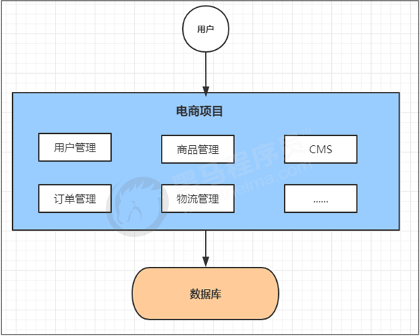

**优点:**

* 项目架构简单，小型项目的话， 开发成本低

* 项目部署在一个节点上， 维护方便

**缺点**

* 全部功能集成在一个工程中，对于大型项目来讲不易开发和维护
* 项目模块之间紧密耦合，单点容错率低

* 无法针对不同模块进行针对性优化和水平扩展

### 1.1.2垂直应用架构

​	随着访问量的逐渐增大，单一应用只能依靠增加节点来应对，但是这时候会发现并不是所有的模块都会有比较大的访问量.

​	还是以上面的电商为例子， 用户访问量的增加可能影响的只是用户和订单模块， 但是对消息模块的影响就比较小. 那么此时我们希望只多增加几个订单模块， 而不增加消息模块. 此时单体应用就做不到了， 垂直应用就应运而生了.

​	所谓的垂直应用架构，就是将原来的一个应用拆成互不相干的几个应用，以提升效率。比如我们可以将上面电商的单体应用拆分成:

* 电商系统(用户管理 商品管理 订单管理)
* 后台系统(用户管理 订单管理 客户管理) 
* CMS系统(广告管理 营销管理)

​	这样拆分完毕之后，一旦用户访问量变大，只需要增加电商系统的节点就可以了，而无需增加后台和CMS的节点。

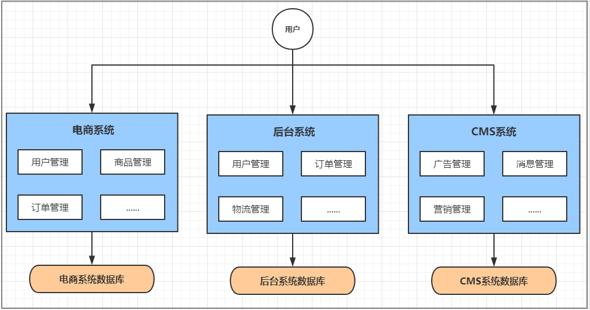

**优点：**

* 系统拆分实现了流量分担，解决了并发问题，而且可以针对不同模块进行优化和水平扩展
* 一个系统的问题不会影响到其他系统，提高容错率

**缺点：**

* 系统之间相互独立， 无法进行相互调用 
* 系统之间相互独立， 会有重复的开发任务

### 1.1.3分布式架构

​	当垂直应用越来越多，重复的业务代码就会越来越多。这时候，我们就思考可不可以将重复的代码抽取出来，做成统一的业务层作为独立的服务，然后由前端控制层调用不同的业务层服务呢？

​	这就产生了新的分布式系统架构。它将把工程拆分成表现层和服务层两个部分，服务层中包含业务逻辑。表现层只需要处理和页面的交互，业务逻辑都是调用服务层的服务来实现。

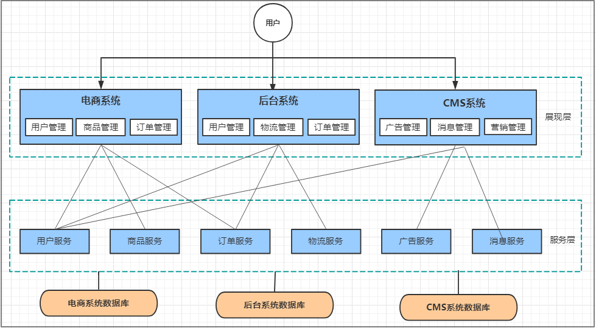

**优点：**

* 抽取公共的功能为服务层，提高代码复用性

**缺点**：

* 系统间耦合度变高，调用关系错综复杂，难以维护

### 1.1.4SOA架构

​	在分布式架构下，当服务越来越多，容量的评估，小服务资源的浪费等问题逐渐显现，此时需增加一个调度中心对集群进行实时管理。此时，用于资源调度和治理中心(SOA Service Oriented Architecture，面向服务的架构)是关键。

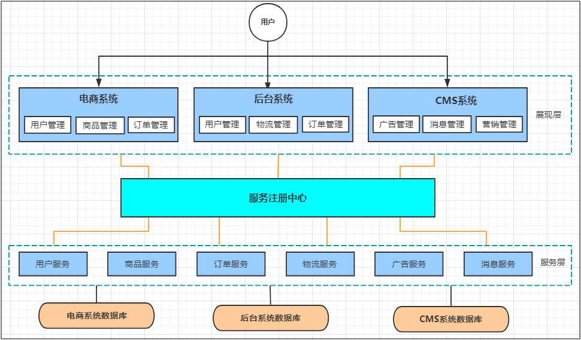

**优点:**

* 使用注册中心解决了服务间调用关系的自动调节

**缺点:**

* 服务间会有依赖关系，一旦某个环节出错会影响较大( 服务雪崩 )

* 服务关心复杂，运维、测试部署困难

### 1.1.5微服务架构

​	微服务架构在某种程度上是面向服务的架构SOA继续发展的下一步，它更加强调服务的\"彻底拆分\"。

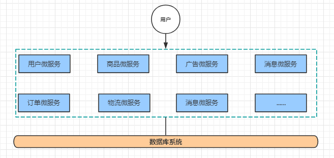

**优点**：

* 服务原子化拆分，独立打包、部署和升级，保证每个微服务清晰的任务划分，利于扩展
* 微服务之间采用Restful等轻量级http协议相互调用

**缺点**：

* 分布式系统开发的技术成本高（容错、分布式事务等）

## 1.2微服务架构介绍

​	微服务架构， 简单的说就是将单体应用进一步拆分，拆分成更小的服务，每个服务都是一个可以独立运行的项目。

### 1.2.1微服务架构的常见问题

一旦采用微服务系统架构，就势必会遇到这样几个问题：

* 这么多小服务，如何管理他们？(服务治理 注册中心\[服务注册 发现 剔除\])
* 这么多小服务，他们之间如何通讯？(**restful** rpc)

* 这么多小服务，客户端怎么访问他们？(网关)

* 这么多小服务，一旦出现问题了，应该如何自处理？(容错)
* 这么多小服务，一旦出现问题了，应该如何排错? (链路追踪)

​	对于上面的问题，是任何一个微服务设计者都不能绕过去的，因此大部分的微服务产品都针对每一个问题提供了相应的组件来解决它们。

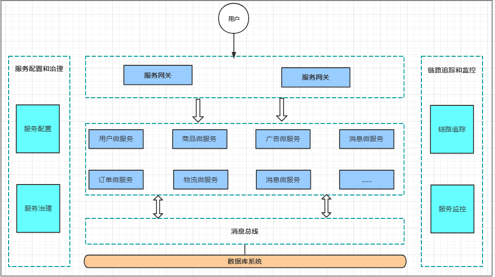

### 1.2.2微服务架构的常见概念

#### 1.2.2.1服务治理

​	服务治理就是进行服务的自动化管理，其核心是服务的自动注册与发现。

**服务注册**：服务实例将自身服务信息注册到注册中心。

**服务发现**：服务实例通过注册中心，获取到注册到其中的服务实例的信息，通过这些信息去请求它们提供的服务。

**服务剔除**：服务注册中心将出问题的服务自动剔除到可用列表之外，使其不会被调用到。

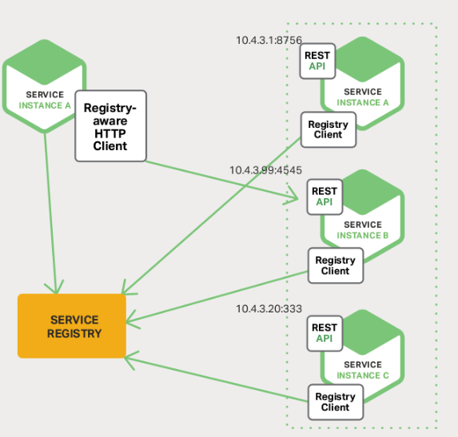

#### 1.2.2.2服务调用

​	在微服务架构中，通常存在多个服务之间的远程调用的需求。目前主流的远程调用技术有基于

HTTP的RESTful接口以及基于TCP的RPC协议。

* **REST**(Representational State Transfer)

​	这是一种HTTP调用的格式，更标准，更通用，无论哪种语言都支持http协议

* **RPC**（Remote Promote Call）

​		一种进程间通信方式。允许像调用本地服务一样调用远程服务。RPC框架的主要目标就是让远		程服务调用更简单、透明。RPC框架负责屏蔽底层的传输方式、序列化方式和通信细节。开发		人员在使用的时候只需要了解谁在什么位置提供了什么样的远程服务接口即可，并不需要关心		底层通信细节和调用过程。

**区别与联系**

| 比较项   | RESTful    | RPC         |
| -------- | ---------- | ----------- |
| 通讯协议 | HTTP       | 一般使用TCP |
| 性能     | 率低       | 较高        |
| 灵活度   | 高         | 低          |
| 应用     | 微服务架构 | SOA架构     |


#### 1.2.2.3服务网关

​	随着微服务的不断增多，不同的微服务一般会有不同的网络地址，而外部客户端可能需要调用多个服务的接口才能完成一个业务需求，如果让客户端直接与各个微服务通信可能出现：

* 客户端需要调用不同的url地址，增加难度
* 在一定的场景下，存在跨域请求的问题 
* 每个微服务都需要进行单独的身份认证

针对这些问题，API网关顺势而生。

​	API网关直面意思是将所有API调用统一接入到API网关层，由网关层统一接入和输出。一个网关的基本功能有：统一接入、安全防护、协议适配、流量管控、长短链接支持、容错能力。有了网关之后，各个API服务提供团队可以专注于自己的的业务逻辑处理，而API网关更专注于安全、流量、路由等问 题。

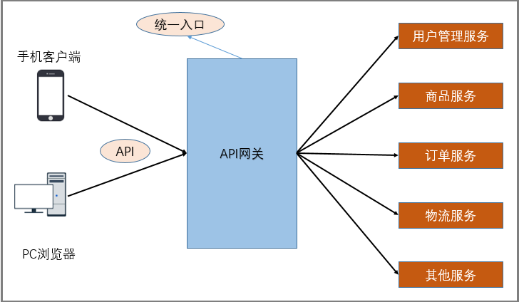

#### 1.2.2.4服务容错

​	在微服务当中，一个请求经常会涉及到调用几个服务，如果其中某个服务不可用，没有做服务容错的话，极有可能会造成一连串的服务不可用，这就是雪崩效应。

我们没法预防雪崩效应的发生，只能尽可能去做好容错。服务容错的三个核心思想是：不被外界环境影响

* 不被外界环境影响
* 不被上游请求压垮
* 不被下游响应拖垮

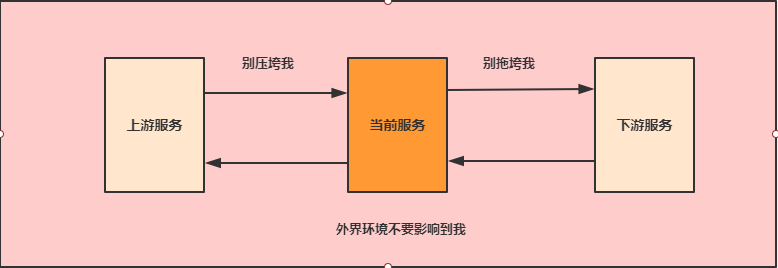

#### 1.2.2.5链路追踪

​	随着微服务架构的流行，服务按照不同的维度进行拆分，一次请求往往需要涉及到多个服务。互联网应用构建在不同的软件模块集上，这些软件模块，有可能是由不同的团队开发、可能使用不同的编程语言来实现、有可能布在了几千台服务器，横跨多个不同的数据中心。因此，就需要对一次请求涉及的多个服务链路进行日志记录，性能监控即链路追踪

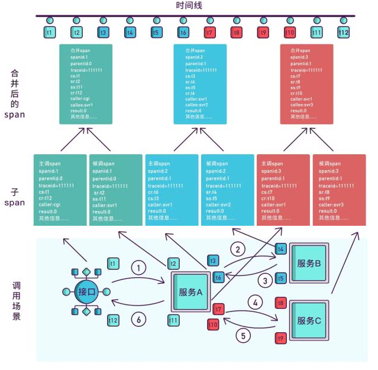

### 1.2.3微服务架构的常见解决方案

#### 1.2.3.1ServiceComb

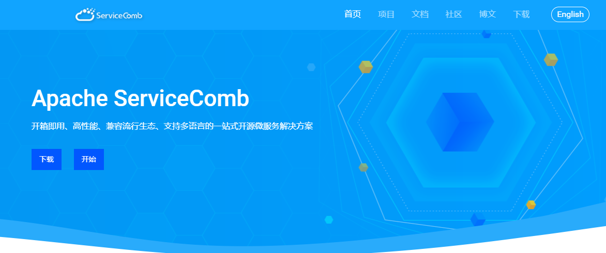

​	Apache ServiceComb，前身是华为云的微服务引擎 CSE (Cloud Service Engine) 云服务，是全球首个Apache微服务顶级项目。它提供了一站式的微服务开源解决方案，致力于帮助企业、用户和开发者将企业应用轻松微服务化上云，并实现对微服务应用的高效运维管理。

#### 1.2.3.2SpringCloud

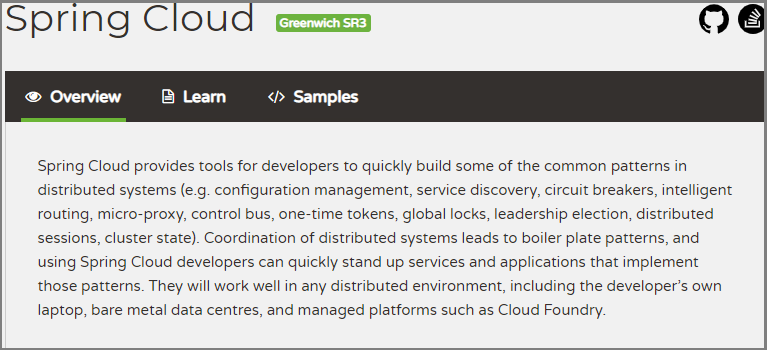

​	Spring Cloud是一系列框架的集合。它利用Spring Boot的开发便利性巧妙地简化了分布式系统基础设施的开发，如服务发现注册、配置中心、消息总线、负载均衡、断路器、数据监控等，都可以用 Spring Boot的开发风格做到一键启动和部署。

​	Spring Cloud并没有重复制造轮子，它只是将目前各家公司开发的比较成熟、经得起实际考验的服务框架组合起来，通过Spring Boot风格进行再封装屏蔽掉了复杂的配置和实现原理，最终给开发者留出了一套简单易懂、易部署和易维护的分布式系统开发工具包。

#### 1.2.3.3SpringCloud Alibaba

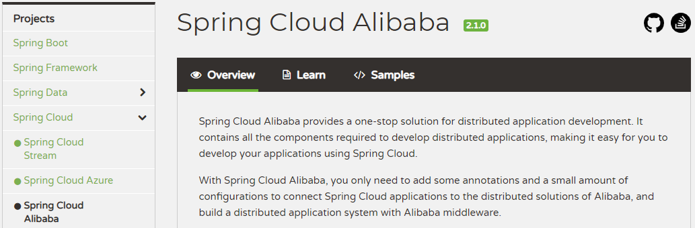

​	Spring Cloud Alibaba 致力于提供微服务开发的一站式解决方案。此项目包含开发分布式应用微服务的必需组件，方便开发者通过 Spring Cloud 编程模型轻松使用这些组件来开发分布式应用服务。

## 1.3 SpringCloud Alibaba介绍

​	Spring Cloud Alibaba 致力于提供微服务开发的一站式解决方案。此项目包含开发分布式应用微服务的必需组件，方便开发者通过 Spring Cloud 编程模型轻松使用这些组件来开发分布式应用服务。

​	依托 Spring Cloud Alibaba，您只需要添加一些注解和少量配置，就可以将 Spring Cloud 应用接入阿里微服务解决方案，通过阿里中间件来迅速搭建分布式应用系统。

### 1.3主要功能

* **服务限流降级**：默认支持 WebServlet、WebFlux， OpenFeign、RestTemplate、Spring Cloud Gateway， Zuul， Dubbo 和 RocketMQ 限流降级功能的接入，可以在运行时通过控制台实时修改限流降级规则，还支持查看限流降级 Metrics 监控。
* **服务注册与发现**：适配 Spring Cloud 服务注册与发现标准，默认集成了 Ribbon 的支持。
* **分布式配置管理**：支持分布式系统中的外部化配置，配置更改时自动刷新。 **消息驱动能力**：基于 Spring Cloud Stream 为微服务应用构建消息驱动能力。

* **分布式事务**：使用 \@GlobalTransactional 注解， 高效并且对业务零侵入地解决分布式事务问题。
* **阿里云对象存储**：阿里云提供的海量、安全、低成本、高可靠的云存储服务。支持在任何应用、任何时间、任何地点存储和访问任意类型的数据。

* **分布式任务调度**：提供秒级、精准、高可靠、高可用的定时（基于 Cron 表达式）任务调度服务。同时提供分布式的任务执行模型，如网格任务。网格任务支持海量子任务均匀分配到所有 Worker（schedulerx-client）上执行。

* **阿里云短信服务**：覆盖全球的短信服务，友好、高效、智能的互联化通讯能力，帮助企业迅速搭建客户触达通道。

### 1.3.2组件

* **Sentinel**：把流量作为切入点，从流量控制、熔断降级、系统负载保护等多个维度保护服务的稳定性。

* **Nacos**：一个更易于构建云原生应用的动态服务发现、配置管理和服务管理平台。 **RocketMQ**：一款开源的分布式消息系统，基于高可用分布式集群技术，提供低延时的、高可靠的消息发布与订阅服务。

* **Dubbo**：Apache Dubbo™ 是一款高性能 Java RPC 框架。

* **Seata**：阿里巴巴开源产品，一个易于使用的高性能微服务分布式事务解决方案。

* **Alibaba Cloud ACM**：一款在分布式架构环境中对应用配置进行集中管理和推送的应用配置中心产品。

* **Alibaba Cloud OSS**: 阿里云对象存储服务（Object Storage Service，简称 OSS），是阿里云提 供的海量、安全、低成本、高可靠的云存储服务。您可以在任何应用、任何时间、任何地点存储和访问任意类型的数据。

* **Alibaba Cloud SchedulerX**: 阿里中间件团队开发的一款分布式任务调度产品，提供秒级、精准、高可靠、高可用的定时（基于 Cron 表达式）任务调度服务。

* **Alibaba Cloud SMS**: 覆盖全球的短信服务，友好、高效、智能的互联化通讯能力，帮助企业迅速搭建客户触达通道。

# 第二章 微服务环境搭建

我们本次是使用的电商项目中的商品、订单、用户为案例进行讲解。

## 2.1案例准备

### 2.1.1技术选型

maven：3.3.9

数据库：MySQL 5.7

持久层: SpingData Jpa

其他: SpringCloud Alibaba 技术栈

### 2.1.2模块设计

springcloud-alibaba 父工程

shop-common 公共模块【实体类】 

shop-user 用户微服务 【端口: 807x】

shop-product 商品微服务 【端口: 808x】 

shop-order 订单微服务 【端口: 809x】

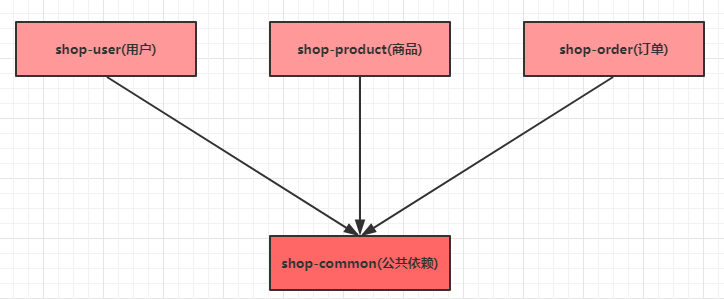

### 2.1.3微服务调用

​	在微服务架构中，最常见的场景就是微服务之间的相互调用。我们以电商系统中常见的**用户下单**为例来演示微服务的调用：客户向订单微服务发起一个下单的请求，在进行保存订单之前需要调用商品微服务查询商品的信息。

​	我们一般把服务的主动调用方称为**服务消费者**，把服务的被调用方称为**服务提供者**。

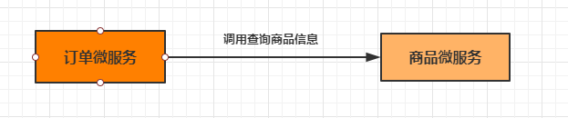

​	在这种场景下，订单微服务就是一个服务消费者， 商品微服务就是一个服务提供者。

## 2.2创建父工程

创建一个maven工程，然后在pom.xml文件中添加下面内容

 ```  apl
<project xmlns="http://maven.apache.org/POM/4.0.0"
xmlns:xsi="http://www.w3.org/2001/XMLSchema-instance"
xsi:schemaLocation="http://maven.apache.org/POM/4.0.0
http://maven.apache.org/xsd/maven-4.0.0.xsd">
<modelVersion>4.0.0</modelVersion>
<parent>
<groupId>org.springframework.boot</groupId>
<artifactId>spring-boot-starter-parent</artifactId>
<version>2.1.3.RELEASE</version>
</parent>
<groupId>com.itheima</groupId>
<artifactId>springcloud-alibaba</artifactId>
<version>1.0-SNAPSHOT</version>
<packaging>pom</packaging>
<properties>
<java.version>1.8</java.version>
<project.build.sourceEncoding>UTF-8</project.build.sourceEncoding>
<project.reporting.outputEncoding>UTF-
8</project.reporting.outputEncoding>
<spring-cloud.version>Greenwich.RELEASE</spring-cloud.version>
<spring-cloud-alibaba.version>2.1.0.RELEASE</spring-cloudalibaba.
version>
</properties>
<dependencyManagement>
<dependencies>
<dependency>
<groupId>org.springframework.cloud</groupId>
<artifactId>spring-cloud-dependencies</artifactId>
<version>${spring-cloud.version}</version>
<type>pom</type>
<scope>import</scope>
</dependency>
<dependency>
<groupId>com.alibaba.cloud</groupId>
<artifactId>spring-cloud-alibaba-dependencies</artifactId>
<version>${spring-cloud-alibaba.version}</version>
<type>pom</type>
<scope>import</scope>
</dependency>
</dependencies>
</dependencyManagement>
</project>
 ```

版本对应：

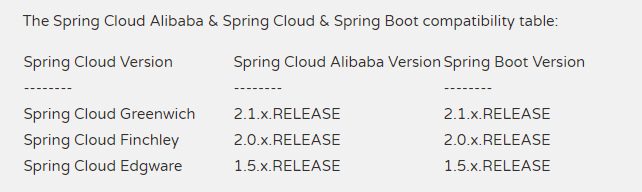

## 2.3创建基础模块

1. 创建`shop-common `模块，在pom.xml中添加依赖

   ```xml
   <?xml version="1.0" encoding="UTF-8"?>
   <project xmlns="http://maven.apache.org/POM/4.0.0"
   xmlns:xsi="http://www.w3.org/2001/XMLSchema-instance"
   xsi:schemaLocation="http://maven.apache.org/POM/4.0.0
   http://maven.apache.org/xsd/maven-4.0.0.xsd">
   <parent>
   <artifactId>springcloud-alibaba</artifactId>
   <groupId>com.itheima</groupId>
   <version>1.0-SNAPSHOT</version>
   </parent>
   <modelVersion>4.0.0</modelVersion>
   <artifactId>shop-common</artifactId>
   <dependencies>
   <dependency>
   <groupId>org.springframework.boot</groupId>
   <artifactId>spring-boot-starter-data-jpa</artifactId>
   </dependency>
   <dependency>
   <groupId>org.projectlombok</groupId>
   <artifactId>lombok</artifactId>
   </dependency>
   <dependency>
   <groupId>com.alibaba</groupId>
   <artifactId>fastjson</artifactId>
   <version>1.2.56</version>
   </dependency>
   <dependency>
   <groupId>mysql</groupId>
   <artifactId>mysql-connector-java</artifactId>
   <version>5.1.6</version>
   </dependency>
   </dependencies>
   </project>

2. 创建实体类

   ```java
   //用户
   @Entity(name = "shop_user")
   @Data
   public class User {
   	@Id
   	@GeneratedValue(strategy = GenerationType.IDENTITY)
       private Integer uid;//主键
       private String username;//用户名
       private String password;//密码
       private String telephone;//手机号
   }
   ```

   ```java
   //商品
   @Entity(name = "shop_product")
   @Data
   public class Product {
       @Id
       @GeneratedValue(strategy = GenerationType.IDENTITY)
       private Integer pid;//主键
       private String pname;//商品名称
       private Double pprice;//商品价格
       private Integer stock;//库存
   }
   ```

   ``` java
   //订单
   @Entity(name = "shop_order")
   @Data
   public class Order {
       @Id
       @GeneratedValue(strategy = GenerationType.IDENTITY)
       private Long oid;//订单id
       private Integer uid;//用户id
       private String username;//用户名
       private Integer pid;//商品id
       private String pname;//商品名称
       private Double pprice;//商品单价
       private Integer number;//购买数量
   }


## 2.4创建用户微服务

**步骤:**

1.  创建模块 导入依赖

2.  创建SpringBoot主类

3.  加入配置文件

4.  创建必要的接口和实现类(controller service dao)

​	新建一个shop-user 模块，然后进行下面操作

1. 创建pom.xml

   ```xml
   <?xml version="1.0" encoding="UTF-8"?>
   <project xmlns="http://maven.apache.org/POM/4.0.0"
   xmlns:xsi="http://www.w3.org/2001/XMLSchema-instance"
   xsi:schemaLocation="http://maven.apache.org/POM/4.0.0
   http://maven.apache.org/xsd/maven-4.0.0.xsd">
   <parent>
   <artifactId>springcloud-alibaba</artifactId>
   <groupId>com.itheima</groupId>
   <version>1.0-SNAPSHOT</version>
   </parent>
   <modelVersion>4.0.0</modelVersion>
   <artifactId>shop-user</artifactId>
   <dependencies>
   <dependency>
   <groupId>com.itheima</groupId>
   <artifactId>shop-common</artifactId>
   <version>1.0-SNAPSHOT</version>
   </dependency>
   </dependencies>
   </project>

2. 编写主类

   ```java
   @SpringBootApplication
   @EnableDiscoveryClient
   public class UserApplication {
       public static void main(String[] args) {
       	SpringApplication.run(UserApplication.class， args);
       }
   }

3. 创建配置文件

   ```
   server:
   	port: 8071
   spring:
   	application:
   		name: service-product
   	datasource:
   		driver-class-name: com.mysql.jdbc.Driver
   		url: jdbc:mysql:///shop?
   serverTimezone=UTC&useUnicode=true&characterEncoding=utf-8&useSSL=true
   		username: root
   		password: root
       jpa:
       	properties:
       		hibernate:
       			hbm2ddl:
       				auto: update
       			dialect: org.hibernate.dialect.MySQL5InnoDBDialect
   ```

   ## 2.5创建商品微服务

1.  创建一个名为shop_product 的模块，并添加springboot依赖

2.  {width="3.0156561679790026in" height="1.6210520559930008in"}创建工程的主类

3.  {width="3.0156561679790026in" height="1.6210520559930008in"}创建配置文件application.yml

4.  创建ProductDao接口

5.  创建ProductService接口和实现类

6.  {width="3.015667104111986in" height="1.6210520559930008in"}创建Controller

7.  {width="3.015667104111986in" height="1.6210520559930008in"}启动工程，等到数据库表创建完毕之后，加入测试数据

8.  通过浏览器访问服务

> {width="4.197926509186352in" height="1.6145833333333333in"}

## 创建订单微服务

1.  创建一个名为shop-order 的模块,并添加springboot依赖


2.  创建工程的主类

3.  {width="3.0156660104986877in" height="1.6210520559930008in"}创建配置文件application.yml

4.  {width="3.0156660104986877in" height="1.6210520559930008in"}创建OrderDao接口

5.  创建OrderService接口和实现类

> {width="3.015667104111986in" height="1.6210520559930008in"}

6.  {width="3.015667104111986in" height="1.6210520559930008in"}创建RestTemplate

7.  创建Controller

> {width="3.015676946631671in" height="1.6210520559930008in"}7 启动工程,通过浏览器访问服务进行测试

{width="4.520832239720035in" height="2.2083333333333335in"}

# 第三章 Nacos Discovery\--服务治理

## {width="3.015676946631671in" height="1.6210520559930008in"}服务治理介绍

##### 先来思考一个问题

> 通过上一章的操作，我们已经可以实现微服务之间的调用。但是我们把服务提供者的网络地址
>
> （ip，端口）等硬编码到了代码中，这种做法存在许多问题：
>
> 一旦服务提供者地址变化，就需要手工修改代码一旦是多个服务提供者，无法实现负载均衡功能一旦服务变得越来越多，人工维护调用关系困难
>
> 那么应该怎么解决呢， 这时候就需要通过注册中心动态的实现**服务治理**。

##### 什么是服务治理

> 服务治理是微服务架构中最核心最基本的模块。用于实现各个微服务的**自动化注册与发现**。
>
> **服务注册：**在服务治理框架中，都会构建一个注册中心，每个服务单元向注册中心登记自己提供服务的详细信息。并在注册中心形成一张服务的清单，服务注册中心需要以心跳的方式去监测清单中的服务是否可用，如果不可用，需要在服务清单中剔除不可用的服务。
>
> **服务发现：**服务调用方向服务注册中心咨询服务，并获取所有服务的实例清单，实现对具体服务实例的访问。


> 通过上面的调用图会发现，除了微服务，还有一个组件是**服务注册中心**，它是微服务架构非常重要的一个组件，在微服务架构里主要起到了协调者的一个作用。注册中心一般包含如下几个功能：

1.  服务发现：

> 服务注册：保存服务提供者和服务调用者的信息
>
> {width="3.0156583552055993in" height="1.6210520559930008in"}服务订阅：服务调用者订阅服务提供者的信息，注册中心向订阅者推送提供者的信息

2.  服务配置：

> 配置订阅：服务提供者和服务调用者订阅微服务相关的配置配置下发：主动将配置推送给服务提供者和服务调用者

3.  服务健康检测

> 检测服务提供者的健康情况，如果发现异常，执行服务剔除

##### 常见的注册中心

> **Zookeeper**
>
> zookeeper是一个分布式服务框架，是Apache Hadoop 的一个子项目，它主要是用来解决分布式应用中经常遇到的一些数据管理问题，如：统一命名服务、状态同步服务、集群管理、分布式应用配置项的管理等。

##### Eureka

> Eureka是Springcloud Netflix中的重要组件，主要作用就是做服务注册和发现。但是现在已经闭源

##### Consul

> Consul是基于GO语言开发的开源工具，主要面向分布式，服务化的系统提供服务注册、服务发现和配置管理的功能。Consul的功能都很实用，其中包括：服务注册/发现、健康检查、Key/Value存储、多数据中心和分布式一致性保证等特性。Consul本身只是一个二进制的可执行文件，所以安装和部署都非常简单，只需要从官网下载后，在执行对应的启动脚本即可。

##### Nacos

> Nacos是一个更易于构建云原生应用的动态服务发现、配置管理和服务管理平台。它是 Spring Cloud Alibaba 组件之一，负责服务注册发现和服务配置，可以这样认为nacos=eureka+config。

## nacos简介

> {width="3.015676946631671in" height="1.6210520559930008in"}Nacos 致力于帮助您发现、配置和管理微服务。Nacos 提供了一组简单易用的特性集，帮助您快速实现动态服务发现、服务配置、服务元数据及流量管理。
>
> 从上面的介绍就可以看出，**nacos的作用就是一个注册中心**，用来管理注册上来的各个微服务。

## nacos实战入门

> 接下来，我们就在现有的环境中加入nacos，并将我们的两个微服务注册上去。

### 搭建nacos环境

> 第1步: 安装nacos
>
> 第2步: 启动nacos
>
> {width="3.015676946631671in" height="1.6210520559930008in"}第3步: 访问nacos
>
> 打开浏览器输入<span class="underline">http://localhost:8848/nacos</span>，即可访问服务， 默认密码是nacos/nacos

{width="6.081935695538058in" height="2.3336450131233595in"}

### 将商品微服务注册到nacos

> 接下来开始修改shop-product 模块的代码， 将其注册到nacos服务上

1.  在pom.xml中添加nacos的依赖

2.  {width="3.0156561679790026in" height="1.6210520559930008in"}在主类上添加**\@EnableDiscoveryClient**注解

3.  在application.yml中添加nacos服务的地址

4.  {width="3.0156561679790026in" height="1.6210520559930008in"}启动服务， 观察nacos的控制面板中是否有注册上来的商品微服务

{width="6.118557524059493in" height="1.3930205599300087in"}

### 将订单微服务注册到nacos

> 接下来开始修改shop_order 模块的代码， 将其注册到nacos服务上

1.  在pom.xml中添加nacos的依赖

2.  在主类上添加**\@EnableDiscoveryClient**注解

> {width="3.015676946631671in" height="1.6210520559930008in"}

3.  在application.yml中添加nacos服务的地址

4.  {width="3.015676946631671in" height="1.6210520559930008in"}修改OrderController， 实现微服务调用

> {width="3.0156583552055993in" height="1.6210520559930008in"}DiscoveryClient是专门负责服务注册和发现的，我们可以通过它获取到注册到注册中心的所有服务

5.  启动服务， 观察nacos的控制面板中是否有注册上来的订单微服务，然后通过访问消费者服务验证调用是否成功

{width="6.111581364829396in" height="1.4422911198600175in"}

1.  ## 实现服务调用的负载均衡

    1.  ### 什么是负载均衡

> {width="3.0156583552055993in" height="1.6210520559930008in"}通俗的讲， 负载均衡就是将负载（工作任务，访问请求）进行分摊到多个操作单元（服务器,组件）上进行执行。
>
> 根据负载均衡发生位置的不同,一般分为**服务端负载均衡**和**客户端负载均衡**。服务端负载均衡指的是发生在服务提供者一方,比如常见的nginx负载均衡
>
> 而客户端负载均衡指的是发生在服务请求的一方，也就是在发送请求之前已经选好了由哪个实例处理请求。

{width="6.118133202099737in" height="2.2125in"}

> 我们在微服务调用关系中一般会选择客户端负载均衡，也就是在服务调用的一方来决定服务由哪个提供者执行。

### 自定义实现负载均衡

> 1 通过idea再启动一个shop-product 微服务，设置其端口为8082

{width="6.135550087489064in" height="1.045103893263342in"}

> 3 修改shop-order 的代码，实现负载均衡


> {width="3.0156660104986877in" height="1.6210520559930008in"}


### 基于Ribbon实现负载均衡

##### Ribbon是Spring Cloud的一个组件， 它可以让我们使用一个注解就能轻松的搞定负载均衡

> 第1步：在RestTemplate 的生成方法上添加@LoadBalanced注解
>
> {width="3.0156692913385825in" height="1.6210520559930008in"}
>
> {width="3.0156692913385825in" height="1.6210520559930008in"}第2步：修改服务调用的方法

##### Ribbon支持的负载均衡策略

> Ribbon内置了多种负载均衡策略,内部负载均衡的顶级接口为
>
> com.netflix.loadbalancer.IRule , 具体的负载策略如下图所示:

+-----------------------------+--------------------------------------------------------------------------------------------------------------------------------------------+-----------------------------------------------------------------------------------------------------------------------------------------------------------------------------------------------------------------------------------+
| > **策略名**                | > **策略描述**                                                                                                                             | > **实现说明**                                                                                                                                                                                                                    |
+=============================+============================================================================================================================================+===================================================================================================================================================================================================================================+
| > BestAvailableRule         | > 选择一个最小的并发请求的server                                                                                                           | > 逐个考察Server，如果Server被 tripped了，则忽略，在选择其中 ActiveRequestsCount最小的server                                                                                                                                      |
+-----------------------------+--------------------------------------------------------------------------------------------------------------------------------------------+-----------------------------------------------------------------------------------------------------------------------------------------------------------------------------------------------------------------------------------+
| > AvailabilityFilteringRule | > 过滤掉那些因为一直连接失败的被标记为 circuit tripped的后端server，并过滤掉那些高并发的的后端 server（active connections 超过配置的阈值） | > 使用一个AvailabilityPredicate来包含过滤server的逻辑，其实就就是检查 status里记录的各个server的运行状态                                                                                                                          |
+-----------------------------+--------------------------------------------------------------------------------------------------------------------------------------------+-----------------------------------------------------------------------------------------------------------------------------------------------------------------------------------------------------------------------------------+
| > WeightedResponseTimeRule  | > 根据相应时间分配一个weight，相应时间越长，weight越小，被选中的可能性越低。                                                               | > 一个后台线程定期的从status里面读取评价响应时间，为每个server计算一个weight。Weight的计算也比较简单responsetime 减去每个server自己平均的responsetime是server的权 重。当刚开始运行，没有形成statas时，使用roubine策略选择server。 |
+-----------------------------+--------------------------------------------------------------------------------------------------------------------------------------------+-----------------------------------------------------------------------------------------------------------------------------------------------------------------------------------------------------------------------------------+
| > RetryRule                 | > 对选定的负载均衡策略机上重试机制。                                                                                                       | > 在一个配置时间段内当选择server不成功，则一直尝试使用subRule的方式选择一个可用的server                                                                                                                                           |
+-----------------------------+--------------------------------------------------------------------------------------------------------------------------------------------+-----------------------------------------------------------------------------------------------------------------------------------------------------------------------------------------------------------------------------------+
| > RoundRobinRule            | > 轮询方式轮询选择                                                                                                                         | > 轮询index，选择index对应位置的                                                                                                                                                                                                  |
|                             | >                                                                                                                                          | >                                                                                                                                                                                                                                 |
|                             | > server                                                                                                                                   | > server                                                                                                                                                                                                                          |
+-----------------------------+--------------------------------------------------------------------------------------------------------------------------------------------+-----------------------------------------------------------------------------------------------------------------------------------------------------------------------------------------------------------------------------------+
| > RandomRule                | > 随机选择一个server                                                                                                                       | > 在index上随机，选择index对应位置的server                                                                                                                                                                                        |
+-----------------------------+--------------------------------------------------------------------------------------------------------------------------------------------+-----------------------------------------------------------------------------------------------------------------------------------------------------------------------------------------------------------------------------------+
| > ZoneAvoidanceRule         | > 复合判断server所在区域的性能和server的可用性选择server                                                                                   | > 使用ZoneAvoidancePredicate和 AvailabilityPredicate来判断是否选择某个server，前一个判断判定一个 zone的运行性能是否可用，剔除不可用的zone（的所有server）， AvailabilityPredicate用于过滤掉连接数过多的Server。                   |
+-----------------------------+--------------------------------------------------------------------------------------------------------------------------------------------+-----------------------------------------------------------------------------------------------------------------------------------------------------------------------------------------------------------------------------------+

{width="3.015670384951881in" height="1.6210520559930008in"}

> {width="3.015670384951881in" height="1.6210520559930008in"}我们可以通过修改配置来调整Ribbon的负载均衡策略，具体代码如下

2.  ## 基于Feign实现服务调用

    1.  ### 什么是Feign

> Feign是Spring Cloud提供的一个声明式的伪Http客户端， 它使得调用远程服务就像调用本地服务一样简单， 只需要创建一个接口并添加一个注解即可。
>
> Nacos很好的兼容了Feign， Feign默认集成了 Ribbon， 所以在Nacos下使用Fegin默认就实现了负载均衡的效果。

### Feign的使用

1.  {width="3.0156550743657045in" height="1.6210520559930008in"}加入Fegin的依赖

2.  在主类上添加Fegin的注解

3.  {width="3.0156550743657045in" height="1.6210520559930008in"}创建一个service， 并使用Fegin实现微服务调用

4.  修改controller代码，并启动验证

5.  {width="3.0156681977252844in" height="1.6210520559930008in"}重启order微服务,查看效果

# 第四章 Sentinel\--服务容错

## 高并发带来的问题

> {width="3.0156681977252844in" height="1.6210520559930008in"}在微服务架构中，我们将业务拆分成一个个的服务，服务与服务之间可以相互调用，但是由于网络原因或者自身的原因，服务并不能保证服务的100%可用，如果单个服务出现问题，调用这个服务就会出现网络延迟，此时若有大量的网络涌入，会形成任务堆积，最终导致服务瘫痪。

##### 接下来，我们来模拟一个高并发的场景

1.  编写java代码

> {width="3.0156692913385825in" height="1.6210520559930008in"}

2.  {width="3.0156692913385825in" height="1.6210520559930008in"}修改配置文件中tomcat的并发数

3.  接下来使用压测工具,对请求进行压力测试下载地址<span class="underline">https://</span>j<span class="underline">meter.apache.or</span>g/

> 第一步：修改配置，并启动软件
>
> 进入bin目录,修改jmeter.properties文件中的语言支持为language=zh_CN，然后点击jmeter.bat启动软件。
>
> {width="3.1875in" height="1.4895833333333333in"}
>
> {width="3.015670384951881in" height="1.6210520559930008in"}第二步：添加线程组

{width="5.229166666666667in" height="1.6354166666666667in"}

> 第三步：配置线程并发数

{width="5.8362904636920385in" height="2.9546872265966755in"}

> 第四步：添加Http取样

{width="5.458333333333333in" height="0.8333333333333334in"}

> 第五步：配置取样，并启动测试

{width="5.762040682414698in" height="1.360624453193351in"}

4.  访问ｍessage方法观察效果

##### {width="3.015670384951881in" height="1.6210520559930008in"}结论:

> 此时会发现, 由于order方法囤积了大量请求, 导致ｍessage方法的访问出现了问题，这就是**服务雪崩**的雏形。

## 服务雪崩效应

> 在分布式系统中,由于网络原因或自身的原因,服务一般无法保证 100% 可用。如果一个服务出现了问题，调用这个服务就会出现线程阻塞的情况，此时若有大量的请求涌入，就会出现多条线程阻塞等待，进而导致服务瘫痪。
>
> 由于服务与服务之间的依赖性，故障会传播，会对整个微服务系统造成灾难性的严重后果，这就是服务故障的 **"雪崩效应"** 。


> {width="3.0156561679790026in" height="1.6210531496062992in"}雪崩发生的原因多种多样，有不合理的容量设计，或者是高并发下某一个方法响应变慢，亦或是某台机器的资源耗尽。我们无法完全杜绝雪崩源头的发生，只有做好足够的容错，保证在一个服务发生问题，不会影响到其它服务的正常运行。也就是＂雪落而不雪崩＂。

## 常见容错方案

> 要防止雪崩的扩散，我们就要做好服务的容错，容错说白了就是保护自己不被猪队友拖垮的一些措施, 下面介绍常见的服务容错思路和组件。

##### 常见的容错思路

> 常见的容错思路有隔离、超时、限流、熔断、降级这几种，下面分别介绍一下。

##### 隔离

> 它是指将系统按照一定的原则划分为若干个服务模块，各个模块之间相对独立，无强依赖。当有故障发生时，能将问题和影响隔离在某个模块内部，而不扩散风险，不波及其它模块，不影响整体的系统服务。常见的隔离方式有：线程池隔离和信号量隔离．
>
> {width="5.848938101487314in" height="2.3646872265966756in"}

##### {width="3.0156660104986877in" height="1.6210531496062992in"}超时

> 在上游服务调用下游服务的时候，设置一个最大响应时间，如果超过这个时间，下游未作出反应，就断开请求，释放掉线程。

{width="5.84101924759405in" height="2.0166655730533685in"}

##### 限流

> 限流就是限制系统的输入和输出流量已达到保护系统的目的。为了保证系统的稳固运行,一旦达到的需要限制的阈值,就需要限制流量并采取少量措施以完成限制流量的目的。


> **熔断** 在互联网系统中，当下游服务因访问压力过大而响应变慢或失败，上游服务为了保护系统整体的可用性，可以暂时切断对下游服务的调用。这种牺牲局部，保全整体的措施就叫做熔断。

{width="5.778486439195101in" height="1.7883333333333333in"}

> 服务熔断一般有三种状态：
>
> 熔断关闭状态（Closed）
>
> 服务没有故障时，熔断器所处的状态，对调用方的调用不做任何限制熔断开启状态（Open）
>
> 后续对该服务接口的调用不再经过网络，直接执行本地的fallback方法
>
> 半熔断状态（Half-Open）
>
> 尝试恢复服务调用，允许有限的流量调用该服务，并监控调用成功率。如果成功率达到预 期，则说明服务已恢复，进入熔断关闭状态；如果成功率仍旧很低，则重新进入熔断关闭状态。

##### {width="3.0156681977252844in" height="1.6210531496062992in"}降级

> 降级其实就是为服务提供一个托底方案，一旦服务无法正常调用，就使用托底方案。

{width="5.793949037620298in" height="2.041874453193351in"}

##### 常见的容错组件

> **Hystrix**
>
> {width="3.0156681977252844in" height="1.6210531496062992in"}Hystrix是由Netflix开源的一个延迟和容错库，用于隔离访问远程系统、服务或者第三方库，防止级联失败，从而提升系统的可用性与容错性。

##### Resilience4J

> Resilicence4J一款非常轻量、简单，并且文档非常清晰、丰富的熔断工具，这也是Hystrix官方推荐的替代产品。不仅如此，Resilicence4j还原生支持Spring Boot 1.x/2.x，而且监控也支持和 prometheus等多款主流产品进行整合。

##### Sentinel

> Sentinel 是阿里巴巴开源的一款断路器实现，本身在阿里内部已经被大规模采用，非常稳定。下面是三个组件在各方面的对比：

+------------------+--------------------------------------------------------------+---------------------------+------------------------------------+
|                  | > **Sentinel**                                               | > **Hystrix**             | > **resilience4j**                 |
+==================+==============================================================+===========================+====================================+
| > 隔离策略       | > 信号量隔离（并发线程数限流）                               | > 线程池隔离/信号量隔离   | > 信号量隔离                       |
+------------------+--------------------------------------------------------------+---------------------------+------------------------------------+
| > 熔断降级策略   | > 基于响应时间、异常比率、异常数                             | > 基于异常比率            | > 基于异常比率、响应时间           |
+------------------+--------------------------------------------------------------+---------------------------+------------------------------------+
| > 实时统计实现   | > 滑动窗口（LeapArray）                                      | > 滑动窗口（基于 RxJava） | > Ring Bit Buffer                   |
+------------------+--------------------------------------------------------------+---------------------------+------------------------------------+
| > 动态规则配置   | > 支持多种数据源                                             | > 支持多种数据源          | > 有限支持                         |
+------------------+--------------------------------------------------------------+---------------------------+------------------------------------+
| > 扩展性         | > 多个扩展点                                                 | > 插件的形式              | > 接口的形式                       |
+------------------+--------------------------------------------------------------+---------------------------+------------------------------------+
| > 基于注解的支持 | > 支持                                                       | > 支持                    | > 支持                             |
+------------------+--------------------------------------------------------------+---------------------------+------------------------------------+
| > 限流           | > 基于 QPS，支持基于调用关系的限流                           | > 有限的支持              | > Rate Limiter                     |
+------------------+--------------------------------------------------------------+---------------------------+------------------------------------+
| > 流量整形       | > 支持预热模式、匀速器模式、预热排队模式                     | > 不支持                  | > 简单的 Rate Limiter              |
|                  |                                                              |                           | >                                  |
|                  |                                                              |                           | > 模式                             |
+------------------+--------------------------------------------------------------+---------------------------+------------------------------------+
| > 系统自适应保护 | > 支持                                                       | > 不支持                  | > 不支持                           |
+------------------+--------------------------------------------------------------+---------------------------+------------------------------------+
| > 控制台         | > 提供开箱即用的控制台，可配置规则、查看秒级监控、机器发现等 | > 简单的监控查看          | > 不提供控制台，可对接其它监控系统 |
+------------------+--------------------------------------------------------------+---------------------------+------------------------------------+

{width="3.0156692913385825in" height="1.6210531496062992in"}

3.  ## {width="3.0156692913385825in" height="1.6210531496062992in"}Sentinel入门

    1.  ### 什么是Sentinel

> Sentinel (分布式系统的流量防卫兵) 是阿里开源的一套用于**服务容错**的综合性解决方案。它以流量为切入点, 从**流量控制、熔断降级、系统负载保护**等多个维度来保护服务的稳定性。

##### Sentinel 具有以下特征:

> **丰富的应用场景**：Sentinel 承接了阿里巴巴近 10 年的双十一大促流量的核心场景, 例如秒杀（即突发流量控制在系统容量可以承受的范围）、消息削峰填谷、集群流量控制、实时熔断下游不可用应用等。
>
> **完备的实时监控**：Sentinel 提供了实时的监控功能。通过控制台可以看到接入应用的单台机器秒级数据, 甚至 500 台以下规模的集群的汇总运行情况。
>
> **广泛的开源生态**：Sentinel 提供开箱即用的与其它开源框架/库的整合模块, 例如与 Spring Cloud、Dubbo、gRPC 的整合。只需要引入相应的依赖并进行简单的配置即可快速地接入 Sentinel。
>
> **完善的 SPI 扩展点**：Sentinel 提供简单易用、完善的 SPI 扩展接口。您可以通过实现扩展接口来快速地定制逻辑。例如定制规则管理、适配动态数据源等。

##### Sentinel 分为两个部分:

> 核心库（Java 客户端）不依赖任何框架/库,能够运行于所有 Java 运行时环境，同时对 Dubbo / Spring Cloud 等框架也有较好的支持。
>
> 控制台（Dashboard）基于 Spring Boot 开发，打包后可以直接运行，不需要额外的 Tomcat 等应用容器。

### 微服务集成Sentinel

> {width="3.015670384951881in" height="1.6210531496062992in"}为微服务集成Sentinel非常简单, 只需要加入Sentinel的依赖即可

1.  在pom.xml中加入下面依赖

2.  编写一个Controller测试使用

    1.  ### {width="3.015670384951881in" height="1.6210531496062992in"}安装Sentinel控制台

> Sentinel 提供一个轻量级的控制台, 它提供机器发现、单机资源实时监控以及规则管理等功能。
>
> 1 下载jar包,解压到文件夹 <span class="underline">https://</span>g<span class="underline">ithub.com/alibaba/Sentinel/releases</span> 2 启动控制台
>
> 3 修改shop-order ,在里面加入有关控制台的配置
>
> 第4步: 通过浏览器访问localhost:8080 进入控制台 ( 默认用户名密码是 sentinel/sentinel )


##### 补充：了解控制台的使用原理

> Sentinel的控制台其实就是一个SpringBoot编写的程序。我们需要将我们的微服务程序注册到控制台上,即在微服务中指定控制台的地址, 并且还要开启一个跟控制台传递数据的端口, 控制台也可以通过此端口调用微服务中的监控程序获取微服务的各种信息。


### 实现一个接口的限流

1.  通过控制台为message1添加一个流控规则

> {width="6.13086832895888in" height="0.65625in"}


2.  通过控制台快速频繁访问, 观察效果

{width="4.354166666666667in" height="0.8125in"}

1.  ## Sentinel的概念和功能

    1.  ### {width="3.015667104111986in" height="1.6210520559930008in"}基本概念

##### 资源

> **资源就是Sentinel要保护的东西**
>
> 资源是 Sentinel 的关键概念。它可以是 Java 应用程序中的任何内容，可以是一个服务，也可以是一个方法，甚至可以是一段代码。
>
> 我们入门案例中的message1方法就可以认为是一个资源

##### 规则

> **规则就是用来定义如何进行保护资源的**
>
> 作用在资源之上, 定义以什么样的方式保护资源，主要包括流量控制规则、熔断降级规则以及系统保护规则。
>
> 我们入门案例中就是为message1资源设置了一种流控规则, 限制了进入message1的流量

### 重要功能

> {width="5.892854330708661in" height="2.5134372265966753in"}
>
> {width="3.0156561679790026in" height="1.6210531496062992in"}Sentinel的主要功能就是容错，主要体现为下面这三个：

##### 流量控制

> 流量控制在网络传输中是一个常用的概念，它用于调整网络包的数据。任意时间到来的请求往往是随机不可控的，而系统的处理能力是有限的。我们需要根据系统的处理能力对流量进行控制。 Sentinel 作为一个调配器，可以根据需要把随机的请求调整成合适的形状。

##### 熔断降级

> 当检测到调用链路中某个资源出现不稳定的表现，例如请求响应时间长或异常比例升高的时候，则对这个资源的调用进行限制，让请求快速失败，避免影响到其它的资源而导致级联故障。
>
> Sentinel 对这个问题采取了两种手段:通过并发线程数进行限制
>
> {width="3.0156561679790026in" height="1.6210520559930008in"}Sentinel 通过限制资源并发线程的数量，来减少不稳定资源对其它资源的影响。当某个资源出现不稳定的情况下，例如响应时间变长，对资源的直接影响就是会造成线程数的逐步堆 积。当线程数在特定资源上堆积到一定的数量之后，对该资源的新请求就会被拒绝。堆积的线程完成任务后才开始继续接收请求。
>
> 通过响应时间对资源进行降级
>
> 除了对并发线程数进行控制以外，Sentinel 还可以通过响应时间来快速降级不稳定的资源。当依赖的资源出现响应时间过长后，所有对该资源的访问都会被直接拒绝，直到过了指定的时间窗口之后才重新恢复。
>
> **Sentinel 和 Hystrix 的区别**
>
> 两者的原则是一致的, 都是当一个资源出现问题时, 让其快速失败, 不要波及到其它服务但是在限制的手段上, 确采取了完全不一样的方法:
>
> Hystrix 采用的是线程池隔离的方式, 优点是做到了资源之间的隔离, 缺点是增加了线程切换的成本。
>
> Sentinel 采用的是通过并发线程的数量和响应时间来对资源做限制。

##### 系统负载保护

> Sentinel 同时提供系统维度的自适应保护能力。当系统负载较高的时候，如果还持续让 请求进入可能会导致系统崩溃，无法响应。在集群环境下，会把本应这台机器承载的流量转发到其它的机器上去。如果这个时候其它的机器也处在一个边缘状态的时候，Sentinel 提供了对应的保 护机制，让系统的入口流量和系统的负载达到一个平衡，保证系统在能力范围之内处理最多的请 求。
>
> **总之一句话: 我们需要做的事情，就是在Sentinel的资源上配置各种各样的规则，来实现各种容错的功能。**

2.  ## Sentinel规则

    1.  ### {width="3.015667104111986in" height="1.6210531496062992in"}流控规则

> 流量控制，其原理是监控应用流量的QPS(每秒查询率) 或并发线程数等指标，当达到指定的阈值时对流量进行控制，以避免被瞬时的流量高峰冲垮，从而保障应用的高可用性。
>
> 第1步: 点击簇点链路，我们就可以看到访问过的接口地址，然后点击对应的流控按钮，进入流控规则配置页面。新增流控规则界面如下:

{width="6.1308584864391955in" height="3.6431244531933507in"}

> **资源名**：唯一名称，默认是请求路径，可自定义
>
> {width="3.015667104111986in" height="1.6210520559930008in"}**针对来源**：指定对哪个微服务进行限流，默认指default，意思是不区分来源，全部限制**阈值类型/单机阈值**：
>
> QPS（每秒请求数量）: 当调用该接口的QPS达到阈值的时候，进行限流线程数：当调用该接口的线程数达到阈值的时候，进行限流
>
> **是否集群**：暂不需要集群
>
> 接下来我们以QPS为例来研究限流规则的配置。

#### 简单配置

> 我们先做一个简单配置，设置阈值类型为QPS，单机阈值为3。即每秒请求量大于3的时候开始限流。
>
> 接下来，在流控规则页面就可以看到这个配置。

{width="6.1184153543307085in" height="1.077082239720035in"}

> 然后快速访问/order/message1 接口，观察效果。此时发现，当QPS \> 3的时候，服务就不能正常响应，而是返回Blocked by Sentinel (flow limiting)结果。

{width="3.9791655730533684in" height="0.8541666666666666in"}

#### 配置流控模式

> {width="3.015667104111986in" height="1.6210531496062992in"}点击上面设置流控规则的**编辑**按钮，然后在编辑页面点击**高级选项**，会看到有流控模式一栏。

{width="6.134704724409449in" height="3.5933333333333333in"}

> sentinel共有三种流控模式，分别是：
>
> {width="3.015667104111986in" height="1.6210520559930008in"}直接（默认）：接口达到限流条件时，开启限流
>
> 关联：当关联的资源达到限流条件时，开启限流 \[适合做应用让步\]
>
> 链路：当从某个接口过来的资源达到限流条件时，开启限流下面呢分别演示三种模式：

##### 直接流控模式

> 直接流控模式是最简单的模式，当指定的接口达到限流条件时开启限流。上面案例使用的就是直接流控模式。

##### 关联流控模式

> 关联流控模式指的是，当指定接口关联的接口达到限流条件时，开启对指定接口开启限流。
>
> {width="3.0156660104986877in" height="1.6210531496062992in"}第1步：配置限流规则, 将流控模式设置为关联，关联资源设置为的 /order/message2。

{width="6.10821741032371in" height="3.017811679790026in"}

> 第3步：通过postman软件向/order/message2连续发送请求，注意QPS一定要大于3


> 第4步：访问/order/message1,会发现已经被限流

{width="4.0833836395450565in" height="0.6979166666666666in"}

##### 链路流控模式

> 链路流控模式指的是，当从某个接口过来的资源达到限流条件时，开启限流。它的功能有点类似于针对来源配置项，区别在于：**针对来源是针对上级微服务，而链路流控是针对上级接口，也就是说它的粒度更细。**
>
> 第1步： 编写一个service，在里面添加一个方法message
>
> {width="3.015667104111986in" height="1.6210531496062992in"}第2步： 在Controller中声明两个方法，分别调用service中的方法m
>
> {width="3.015667104111986in" height="1.6210520559930008in"}第3步: 禁止收敛URL的入口 context
>
> 从1.6.3 版本开始，Sentinel Web filter默认收敛所有URL的入口context，因此链路限流不生效。
>
> 1.7.0 版本开始（对应SCA的2.1.1.RELEASE)，官方在CommonFilter 引入了
>
> URL 进行链路限流。
>
> 参数，用于控制是否收敛context。将其配置为
>
> 即可根据不同的
>
> SCA 2.1.1.RELEASE之后的版本,可以通过配置spring.cloud.sentinel.web-context-unify=false即可关闭收敛
>
> 我们当前使用的版本是SpringCloud Alibaba 2.1.0.RELEASE，无法实现链路限流。
>
> 目前官方还未发布SCA 2.1.2.RELEASE，所以我们只能使用2.1.1.RELEASE，需要写代码的形式实现

(1) 暂时将SpringCloud Alibaba的版本调整为2.1.1.RELEASE

(2) 配置文件中关闭sentinel的CommonFilter实例化

(3) {width="3.015676946631671in" height="1.6210531496062992in"}添加一个配置类，自己构建CommonFilter实例

> {width="3.015676946631671in" height="1.6210520559930008in"}第4步: 控制台配置限流规则

{width="6.092468285214348in" height="2.9996872265966754in"}

> 第5步: 分别通过/order/message1 和/order/message2 访问, 发现2没问题, 1的被限流了

#### 配置流控效果

> **快速失败（默认）**: 直接失败，抛出异常，不做任何额外的处理，是最简单的效果
>
> **Warm Up**：它从开始阈值到最大QPS阈值会有一个缓冲阶段，一开始的阈值是最大QPS阈值的
>
> 1/3，然后慢慢增长，直到最大阈值，适用于将突然增大的流量转换为缓步增长的场景。
>
> **排队等待**：让请求以均匀的速度通过，单机阈值为每秒通过数量，其余的排队等待； 它还会让设置一个超时时间，当请求超过超时间时间还未处理，则会被丢弃。

### 降级规则

> {width="3.0156583552055993in" height="1.6210531496062992in"}降级规则就是设置当满足什么条件的时候，对服务进行降级。Sentinel提供了三个衡量条件：
>
> 平均响应时间 ：当资源的平均响应时间超过阈值（以 ms 为单位）之后，资源进入准降级状态。如果接下来 1s 内持续进入 5 个请求，它们的 RT都持续超过这个阈值，那么在接下的时间窗口
>
> （以 s 为单位）之内，就会对这个方法进行服务降级。

{width="5.813657042869641in" height="2.485624453193351in"}

> 注意 Sentinel 默认统计的 RT 上限是 4900 ms，超出此阈值的都会算作 4900 ms，若需要变更此上限可以通过启动配置项 -Dcsp.sentinel.statistic.max.rt=xxx 来配置。
>
> {width="3.0156583552055993in" height="1.6210520559930008in"}异常比例：当资源的每秒异常总数占通过量的比值超过阈值之后，资源进入降级状态，即在接下的时间窗口（以 s 为单位）之内，对这个方法的调用都会自动地返回。异常比率的阈值范围是 \[0.0, 1.0\]。
>
> 第1步: 首先模拟一个异常
>
> 第2步: 设置异常比例为0.25
>
> {width="5.8280293088363955in" height="2.408332239720035in"}
>
> {width="3.015676946631671in" height="1.6210531496062992in"}异常数 ：当资源近 1 分钟的异常数目超过阈值之后会进行服务降级。注意由于统计时间窗口是分钟级别的，若时间窗口小于 60s，则结束熔断状态后仍可能再进入熔断状态。

{width="5.818654855643045in" height="2.133853893263342in"}

> 问题：
>
> 流控规则和降级规则返回的异常页面是一样的，我们怎么来区分到底是什么原因导致的呢？

### {width="3.015676946631671in" height="1.6210520559930008in"}热点规则

> 热点参数流控规则是一种更细粒度的流控规则, 它允许将规则具体到参数上。

##### 热点规则简单使用

> 第1步: 编写代码
>
> 第2步: 配置热点规则
>
> {width="6.145051399825022in" height="3.4741666666666666in"}
>
> {width="3.0156561679790026in" height="1.6210531496062992in"}第3步: 分别用两个参数访问,会发现只对第一个参数限流了

{width="6.144977034120735in" height="1.6066666666666667in"}

##### 热点规则增强使用

> 参数例外项允许对一个参数的具体值进行流控编辑刚才定义的规则,增加参数例外项
>
> 

### 授权规则

> 很多时候，我们需要根据调用来源来判断该次请求是否允许放行，这时候可以使用 Sentinel 的来源访问控制的功能。来源访问控制根据资源的请求来源（origin）限制资源是否通过：
>
> {width="3.015676946631671in" height="1.6210520559930008in"}若配置白名单，则只有请求来源位于白名单内时才可通过；
>
> 若配置黑名单，则请求来源位于黑名单时不通过，其余的请求通过。

{width="6.167844488188976in" height="2.150624453193351in"}

> 上面的资源名和授权类型不难理解，但是流控应用怎么填写呢？
>
> 其实这个位置要填写的是来源标识，Sentinel提供了RequestOriginParser 接口来处理来源。
>
> 只要Sentinel保护的接口资源被访问，Sentinel就会调用RequestOriginParser 的实现类去解析访问来源。
>
> 第1步: 自定义来源处理规则
>
> 第2步: 授权规则配置
>
> 这个配置的意思是只有serviceName=pc不能访问(黑名单)
>
> 第3步: 访问 <span class="underline">http://localhost:8091/order/messa</span>g<span class="underline">e1?serviceName=pc</span>观察结果

### {width="3.0156583552055993in" height="1.6210520559930008in"}系统规则

> 系统保护规则是从应用级别的入口流量进行控制，从单台机器的总体 Load、RT、入口 QPS 、CPU使用率和线程数五个维度监控应用数据，让系统尽可能跑在最大吞吐量的同时保证系统整体的稳定性。
>
> 系统保护规则是应用整体维度的，而不是资源维度的，并且仅对入口流量 (进入应用的流量) 生效。
>
> Load（仅对 Linux/Unix-like 机器生效）：当系统 load1 超过阈值，且系统当前的并发线程数超过系统容量时才会触发系统保护。系统容量由系统的 maxQps \* minRt 计算得出。设定参考值一般是 CPU cores \* 2.5。
>
> RT：当单台机器上所有入口流量的平均 RT 达到阈值即触发系统保护，单位是毫秒。线程数：当单台机器上所有入口流量的并发线程数达到阈值即触发系统保护。
>
> 入口 QPS：当单台机器上所有入口流量的 QPS 达到阈值即触发系统保护。
>
> CPU使用率：当单台机器上所有入口流量的 CPU使用率达到阈值即触发系统保护。
>
> **扩展: 自定义异常返回**
>
> {width="3.0156561679790026in" height="1.6210531496062992in"}

## {width="3.0156561679790026in" height="1.6210520559930008in"}\@SentinelResource的使用

> 在定义了资源点之后，我们可以通过Dashboard来设置限流和降级策略来对资源点进行保护。同时还能通过@SentinelResource来指定出现异常时的处理策略。
>
> 用于定义资源，并提供可选的异常处理和 fallback 配置项。其主要参数如下:

+----------------------+----------------------------------------------------------------------------------------------------------------------------------------------------+
| > **属性**           | > **作用**                                                                                                                                         |
+======================+====================================================================================================================================================+
| > value              | > 资源名称                                                                                                                                         |
+----------------------+----------------------------------------------------------------------------------------------------------------------------------------------------+
| > entryType          | > entry类型，标记流量的方向，取值IN/OUT，默认是OUT                                                                                                 |
+----------------------+----------------------------------------------------------------------------------------------------------------------------------------------------+
| > blockHandler       | > 处理BlockException的函数名称,函数要求：                                                                                                          |
|                      |                                                                                                                                                    |
|                      | 1.  必须是 public                                                                                                                                  |
|                      |                                                                                                                                                    |
|                      | 2.  返回类型 参数与原方法一致                                                                                                                      |
|                      |                                                                                                                                                    |
|                      | 3.  默认需和原方法在同一个类中。若希望使用其他类的函数，可配置                                                                                     |
|                      |                                                                                                                                                    |
|                      | > blockHandlerClass ，并指定blockHandlerClass里面的方法。                                                                                          |
+----------------------+----------------------------------------------------------------------------------------------------------------------------------------------------+
| > blockHandlerClass  | > 存放blockHandler的类,对应的处理函数必须static修饰。                                                                                              |
+----------------------+----------------------------------------------------------------------------------------------------------------------------------------------------+
| > fallback           | > 用于在抛出异常的时候提供fallback处理逻辑。fallback函数可以针对所有类型的异常（除了 exceptionsToIgnore 里面排除掉的异常类型）进行处理。函数要求： |
|                      |                                                                                                                                                    |
|                      | 1.  返回类型与原方法一致                                                                                                                           |
|                      |                                                                                                                                                    |
|                      | 2.  参数类型需要和原方法相匹配                                                                                                                     |
|                      |                                                                                                                                                    |
|                      | 3.  默认需和原方法在同一个类中。若希望使用其他类的函数，可配置                                                                                     |
|                      |                                                                                                                                                    |
|                      | > fallbackClass ，并指定fallbackClass里面的方法。                                                                                                  |
+----------------------+----------------------------------------------------------------------------------------------------------------------------------------------------+
| > fallbackClass      | > 存放fallback的类。对应的处理函数必须static修饰。                                                                                                 |
+----------------------+----------------------------------------------------------------------------------------------------------------------------------------------------+
| > defaultFallback    | > 用于通用的 fallback 逻辑。默认fallback函数可以针对所有类型的异常进行处理。若同时配置了 fallback 和 defaultFallback，以fallback为准。函数要求：   |
|                      |                                                                                                                                                    |
|                      | 1.  返回类型与原方法一致                                                                                                                           |
|                      |                                                                                                                                                    |
|                      | 2.  方法参数列表为空，或者有一个 Throwable 类型的参数。                                                                                            |
|                      |                                                                                                                                                    |
|                      | 3.  默认需要和原方法在同一个类中。若希望使用其他类的函数，可配置                                                                                   |
|                      |                                                                                                                                                    |
|                      | > fallbackClass ，并指定 fallbackClass 里面的方法。                                                                                                |
+----------------------+----------------------------------------------------------------------------------------------------------------------------------------------------+
| > exceptionsToIgnore | > 指定排除掉哪些异常。排除的异常不会计入异常统计，也不会进入                                                                                       |
|                      | >                                                                                                                                                  |
|                      | > fallback逻辑，而是原样抛出。                                                                                                                     |
+----------------------+----------------------------------------------------------------------------------------------------------------------------------------------------+
| > exceptionsToTrace  | > 需要trace的异常                                                                                                                                  |
+----------------------+----------------------------------------------------------------------------------------------------------------------------------------------------+

{width="3.0156660104986877in" height="1.6210531496062992in"}

##### {width="3.0156660104986877in" height="1.6210520559930008in"}定义限流和降级后的处理方法

> 方式一：直接将限流和降级方法定义在方法中
>
> {width="3.0156692913385825in" height="1.6210531496062992in"}{width="3.0156692913385825in" height="1.6210520559930008in"}方式二: 将限流和降级方法外置到单独的类中

## {width="3.015670384951881in" height="1.6210531496062992in"}Sentinel规则持久化

> 通过前面的讲解，我们已经知道，可以通过Dashboard来为每个Sentinel客户端设置各种各样的规则，但是这里有一个问题，就是这些规则默认是存放在内存中，极不稳定，所以需要将其持久化。
>
> 本地文件数据源会定时轮询文件的变更，读取规则。这样我们既可以在应用本地直接修改文件来更新规则，也可以通过 Sentinel 控制台推送规则。以本地文件数据源为例，推送过程如下图所示：

{width="6.097222222222222in" height="1.5631244531933508in"}

> 首先 Sentinel 控制台通过 API 将规则推送至客户端并更新到内存中，接着注册的写数据源会将新的规则保存到本地的文件中。

1.  {width="3.015670384951881in" height="1.6210520559930008in"}编写处理类

> String authorityRulePath = ruleDir + \"/authority-rule.json\"; String paramFlowRulePath = ruleDir + \"/param-flow-rule.json\";
>
> this.mkdirIfNotExits(ruleDir); this.createFileIfNotExits(flowRulePath); this.createFileIfNotExits(degradeRulePath); this.createFileIfNotExits(systemRulePath); this.createFileIfNotExits(authorityRulePath); this.createFileIfNotExits(paramFlowRulePath);
>
> // 流控规则
>
> ReadableDataSource\<String, List\<FlowRule\>\> flowRuleRDS = new FileRefreshableDataSource\<\>(
>
> flowRulePath, flowRuleListParser
>
> );
>
> FlowRuleManager.register2Property(flowRuleRDS.getProperty()); WritableDataSource\<List\<FlowRule\>\> flowRuleWDS = new
>
> FileWritableDataSource\<\>(
>
> flowRulePath, this::encodeJson
>
> );
>
> WritableDataSourceRegistry.registerFlowDataSource(flowRuleWDS);
>
> // 降级规则
>
> ReadableDataSource\<String, List\<DegradeRule\>\> degradeRuleRDS = new FileRefreshableDataSource\<\>(
>
> degradeRulePath, degradeRuleListParser
>
> );
>
> DegradeRuleManager.register2Property(degradeRuleRDS.getProperty()); WritableDataSource\<List\<DegradeRule\>\> degradeRuleWDS = new
>
> FileWritableDataSource\<\>(
>
> degradeRulePath, this::encodeJson
>
> );
>
> WritableDataSourceRegistry.registerDegradeDataSource(degradeRuleWDS);
>
> // 系统规则
>
> ReadableDataSource\<String, List\<SystemRule\>\> systemRuleRDS = new FileRefreshableDataSource\<\>(
>
> systemRulePath, systemRuleListParser
>
> );
>
> SystemRuleManager.register2Property(systemRuleRDS.getProperty()); WritableDataSource\<List\<SystemRule\>\> systemRuleWDS = new
>
> FileWritableDataSource\<\>(
>
> systemRulePath, this::encodeJson
>
> );
>
> WritableDataSourceRegistry.registerSystemDataSource(systemRuleWDS);
>
> // 授权规则
>
> ReadableDataSource\<String, List\<AuthorityRule\>\> authorityRuleRDS = new FileRefreshableDataSource\<\>(
>
> authorityRulePath, authorityRuleListParser
>
> );
>
> AuthorityRuleManager.register2Property(authorityRuleRDS.getProperty()); WritableDataSource\<List\<AuthorityRule\>\> authorityRuleWDS = new
>
> FileWritableDataSource\<\>(
>
> authorityRulePath, this::encodeJson
>
> );
>
> WritableDataSourceRegistry.registerAuthorityDataSource(authorityRuleWDS);
>
> // 热点参数规则
>
> ReadableDataSource\<String, List\<ParamFlowRule\>\> paramFlowRuleRDS = new FileRefreshableDataSource\<\>(
>
> paramFlowRulePath, paramFlowRuleListParser
>
> );
>
> ParamFlowRuleManager.register2Property(paramFlowRuleRDS.getProperty()); WritableDataSource\<List\<ParamFlowRule\>\> paramFlowRuleWDS = new
>
> FileWritableDataSource\<\>(
>
> paramFlowRulePath, this::encodeJson
>
> );
>
> ModifyParamFlowRulesCommandHandler.setWritableDataSource(paramFlowRuleWDS);
>
> }
>
> private Converter\<String, List\<FlowRule\>\> flowRuleListParser = source -\> JSON.parseObject(
>
> source,
>
> new TypeReference\<List\<FlowRule\>\>() {
>
> }
>
> );
>
> private Converter\<String, List\<DegradeRule\>\> degradeRuleListParser = source
>
> -\> JSON.parseObject(
>
> source,
>
> new TypeReference\<List\<DegradeRule\>\>() {
>
> }
>
> );
>
> private Converter\<String, List\<SystemRule\>\> systemRuleListParser = source -\> JSON.parseObject(
>
> source,
>
> {width="3.0156692913385825in" height="1.6210531496062992in"}

2.  {width="3.0156692913385825in" height="1.6210520559930008in"}添加配置

> 在resources下创建配置目录 META-INF/services ,然后添加文件
>
> 在文件中添加配置类的全路径

## Feign整合Sentinel

> 第1步: 引入sentinel的依赖
>
> 第2步: 在配置文件中开启Feign对Sentinel的支持
>
> {width="3.015670384951881in" height="1.6210531496062992in"}第3步: 创建容错类
>
> {width="3.015670384951881in" height="1.6210520559930008in"}第4步: 为被容器的接口指定容错类
>
> 第5步: 修改controller
>
> {width="3.0156561679790026in" height="1.6210531496062992in"}
>
> {width="3.0156561679790026in" height="1.6210662729658794in"}第6步: 停止所有shop-product 服务,重启shop-order 服务,访问请求,观察容错效果

{width="4.375015310586177in" height="2.0520833333333335in"}

> **扩展**: 如果想在容错类中拿到具体的错误,可以使用下面的方式
>
> {width="3.0156660104986877in" height="1.6210531496062992in"}
>
> {width="3.0156660104986877in" height="1.6210662729658794in"}**注意: fallback和fallbackFactory只能使用其中一种方式**

# 第五章 Gateway\--服务网关

## 网关简介

> 大家都都知道在微服务架构中，一个系统会被拆分为很多个微服务。那么作为客户端要如何去调用这么多的微服务呢？如果没有网关的存在，我们只能在客户端记录每个微服务的地址，然后分别去调 用。
>
> 
>
> 这样的架构，会存在着诸多的问题：
>
> 客户端多次请求不同的微服务，增加客户端代码或配置编写的复杂性认证复杂，每个服务都需要独立认证。
>
> {width="3.0156681977252844in" height="1.6210662729658794in"}存在跨域请求，在一定场景下处理相对复杂。上面的这些问题可以借助**API网关**来解决。
>
> 所谓的API网关，就是指系统的**统一入口**，它封装了应用程序的内部结构，为客户端提供统一服
>
> 务，一些与业务本身功能无关的公共逻辑可以在这里实现，诸如认证、鉴权、监控、路由转发等等。添加上API网关之后，系统的架构图变成了如下所示：
>
> 
>
> 我们也可以观察下，我们现在的整体架构图：


> 在业界比较流行的网关，有下面这些：

##### Ngnix+lua

> 使用nginx的反向代理和负载均衡可实现对api服务器的负载均衡及高可用
>
> lua是一种脚本语言,可以来编写一些简单的逻辑, nginx支持lua脚本

##### Kong

> 基于Nginx+Lua开发，性能高，稳定，有多个可用的插件(限流、鉴权等等)可以开箱即用。 问题：只支持Http协议；二次开发，自由扩展困难；提供管理API，缺乏更易用的管控、配置方式。
>
> **Zuul** Netflix开源的网关，功能丰富，使用JAVA开发，易于二次开发 问题：缺乏管控，无法动态配置；依赖组件较多；处理Http请求依赖的是Web容器，性能不如Nginx

##### Spring Cloud Gateway

> Spring公司为了替换Zuul而开发的网关服务，将在下面具体介绍。
>
> **注意：SpringCloud alibaba技术栈中并没有提供自己的网关，我们可以采用Spring Cloud Gateway**
>
> **来做网关**

## Gateway简介

> {width="3.015670384951881in" height="1.6210531496062992in"}Spring Cloud Gateway是Spring公司基于Spring 5.0，Spring Boot 2.0 和 Project Reactor 等技术开发的网关，它旨在为微服务架构提供一种简单有效的统一的 API 路由管理方式。它的目标是替代 Netflix Zuul，其不仅提供统一的路由方式，并且基于 Filter 链的方式提供了网关基本的功能，例如：安全，监控和限流。

##### 优点：

> 性能强劲：是第一代网关Zuul的1.6倍
>
> 功能强大：内置了很多实用的功能，例如转发、监控、限流等设计优雅，容易扩展

##### 缺点：

> 其实现依赖Netty与WebFlux，不是传统的Servlet编程模型，学习成本高不能将其部署在Tomcat、Jetty等Servlet容器里，只能打成jar包执行
>
> 需要Spring Boot 2.0及以上的版本，才支持

## Gateway快速入门

> 要求: 通过浏览器访问api网关,然后通过网关将请求转发到商品微服务

### {width="3.015670384951881in" height="1.6210662729658794in"}基础版

> 第1步：创建一个api-gateway 的模块,导入相关依赖
>
> 第2步: 创建主类
>
> {width="3.0156660104986877in" height="1.6210531496062992in"}第3步: 添加配置文件
>
> {width="3.0156660104986877in" height="1.6210673665791775in"}第4步: 启动项目, 并通过网关去访问微服务

{width="4.34375in" height="1.5729166666666667in"}

### 增强版

> 现在在配置文件中写死了转发路径的地址, 前面我们已经分析过地址写死带来的问题, 接下来我们从注册中心获取此地址。
>
> {width="3.015667104111986in" height="1.6210673665791775in"}第1步：加入nacos依赖
>
> 第2步：在主类上添加注解
>
> {width="3.015667104111986in" height="1.6210531496062992in"}第3步：修改配置文件
>
> 第4步:测试
>
> {width="4.34379593175853in" height="1.5729166666666667in"}

### 简写版

> 第1步: 去掉关于路由的配置


> 第2步: 启动项目，并通过网关去访问微服务


> 这时候，就发现只要按照**网关地址/微服务/接口**的格式去访问，就可以得到成功响应。

4.  ## Gateway核心架构

    1.  ### 基本概念

> 路由(Route) 是 gateway 中最基本的组件之一，表示一个具体的路由信息载体。主要定义了下面的几个信息:
>
> **id**，路由标识符，区别于其他 Route。
>
> **uri**，路由指向的目的地 uri，即客户端请求最终被转发到的微服务。 **order**，用于多个 Route 之间的排序，数值越小排序越靠前，匹配优先级越高。 **predicate**，断言的作用是进行条件判断，只有断言都返回真，才会真正的执行路由。 **filter**，过滤器用于修改请求和响应信息。

### 执行流程


> 执行流程大体如下：

1.  Gateway Client向Gateway Server发送请求

2.  请求首先会被HttpWebHandlerAdapter进行提取组装成网关上下文

3.  然后网关的上下文会传递到DispatcherHandler，它负责将请求分发给

> RoutePredicateHandlerMapping

4.  RoutePredicateHandlerMapping负责路由查找，并根据路由断言判断路由是否可用

5.  如果过断言成功，由FilteringWebHandler创建过滤器链并调用

6.  请求会一次经过PreFilter\--微服务\--PostFilter的方法，最终返回响应

## 断言

> Predicate(断言, 谓词) 用于进行条件判断，只有断言都返回真，才会真正的执行路由。断言就是说: 在 **什么条件下** 才能进行路由转发

### 内置路由断言工厂

> SpringCloud Gateway包括许多内置的断言工厂，所有这些断言都与HTTP请求的不同属性匹配。具体如下：
>
> {width="3.015667104111986in" height="1.6210531496062992in"}基于Datetime类型的断言工厂
>
> 此类型的断言根据时间做判断，主要有三个：
>
> AfterRoutePredicateFactory： 接收一个日期参数，判断请求日期是否晚于指定日期 BeforeRoutePredicateFactory： 接收一个日期参数，判断请求日期是否早于指定日期 BetweenRoutePredicateFactory： 接收两个日期参数，判断请求日期是否在指定时间段内
>
> -After=2019-12-31T23:59:59.789+08:00\[Asia/Shanghai\]
>
> 基于远程地址的断言工厂 RemoteAddrRoutePredicateFactory：接收一个IP地址段，判断请求主机地址是否在地址段中
>
> -RemoteAddr=192.168.1.1/24
>
> 基于Cookie的断言工厂
>
> CookieRoutePredicateFactory：接收两个参数，cookie 名字和一个正则表达式。 判断请求
>
> {width="3.015667104111986in" height="1.6210673665791775in"}cookie是否具有给定名称且值与正则表达式匹配。
>
> -Cookie=chocolate, ch.
>
> 基于Header的断言工厂
>
> HeaderRoutePredicateFactory：接收两个参数，标题名称和正则表达式。 判断请求Header是否具有给定名称且值与正则表达式匹配。
>
> -Header=X-Request-Id, \\d+
>
> 基于Host的断言工厂
>
> HostRoutePredicateFactory：接收一个参数，主机名模式。判断请求的Host是否满足匹配规则。
>
> -Host=\*\*.testhost.org
>
> 基于Method请求方法的断言工厂
>
> MethodRoutePredicateFactory：接收一个参数，判断请求类型是否跟指定的类型匹配。
>
> -Method=GET
>
> 基于Path请求路径的断言工厂
>
> PathRoutePredicateFactory：接收一个参数，判断请求的URI部分是否满足路径规则。
>
> -Path=/foo/{segment}
>
> {width="3.0156660104986877in" height="1.6210673665791775in"}基于Query请求参数的断言工厂
>
> QueryRoutePredicateFactory ：接收两个参数，请求param和正则表达式， 判断请求参数是否具有给定名称且值与正则表达式匹配。
>
> -Query=baz, ba.
>
> 基于路由权重的断言工厂
>
> WeightRoutePredicateFactory：接收一个\[组名,权重\], 然后对于同一个组内的路由按照权重转发
>
> routes:
>
> -id: weight_route1 uri: host1 predicates:
>
> {width="3.0156660104986877in" height="1.6210531496062992in"}-Path=/product/\*\*
>
> -Weight=group3, 1
>
> -id: weight_route2 uri: host2 predicates:
>
> -Path=/product/\*\*
>
> -Weight= group3, 9

##### 内置路由断言工厂的使用

> 接下来我们验证几个内置断言的使用:

### 自定义路由断言工厂

> 我们来设定一个场景: 假设我们的应用仅仅让age在(min,max)之间的人来访问。
>
> 第1步：在配置文件中,添加一个Age的断言配置
>
> {width="3.015667104111986in" height="1.6210531496062992in"}{width="3.015667104111986in" height="1.6210673665791775in"}第2步：自定义一个断言工厂, 实现断言方法
>
> {width="3.015676946631671in" height="1.6210531496062992in"}第4步：启动测试

## 过滤器

> {width="3.015676946631671in" height="1.6210673665791775in"}三个知识点:

1.  作用: 过滤器就是在请求的传递过程中,对请求和响应做一些手脚

2.  生命周期: Pre Post

3.  分类: 局部过滤器(作用在某一个路由上) 全局过滤器(作用全部路由上)在Gateway中, Filter的生命周期只有两个："pre" 和 "post"。

> PRE： 这种过滤器在请求被路由之前调用。我们可利用这种过滤器实现身份验证、在集群中选择请求的微服务、记录调试信息等。 POST：这种过滤器在路由到微服务以后执行。这种过滤器可用来为响应添加标准的HTTP Header、收集统计信息和指标、将响应从微服务发送给客户端等。
>
> 
>
> Gateway 的Filter从作用范围可分为两种: GatewayFilter与GlobalFilter。
>
> GatewayFilter：应用到单个路由或者一个分组的路由上。 GlobalFilter：应用到所有的路由上。

### 局部过滤器

> {width="3.0156583552055993in" height="1.6210673665791775in"}局部过滤器是针对单个路由的过滤器。

#### 内置局部过滤器

> 在SpringCloud Gateway中内置了很多不同类型的网关路由过滤器。具体如下：

+-------------------------------+--------------------------------------------------------------------------------------------------+--------------------------------------------------------------------------+
| > **过滤器工厂**              | > **作用**                                                                                       | > **参数**                                                               |
+===============================+==================================================================================================+==========================================================================+
| > AddRequestHeader            | > 为原始请求添加Header                                                                           | > Header的名称及值                                                       |
+-------------------------------+--------------------------------------------------------------------------------------------------+--------------------------------------------------------------------------+
| > AddRequestParameter         | > 为原始请求添加请求参数                                                                         | > 参数名称及值                                                           |
+-------------------------------+--------------------------------------------------------------------------------------------------+--------------------------------------------------------------------------+
| > AddResponseHeader           | > 为原始响应添加Header                                                                           | > Header的名称及值                                                       |
+-------------------------------+--------------------------------------------------------------------------------------------------+--------------------------------------------------------------------------+
| > DedupeResponseHeader        | > 剔除响应头中重复的值                                                                           | > 需要去重的Header名称及去重策略                                         |
+-------------------------------+--------------------------------------------------------------------------------------------------+--------------------------------------------------------------------------+
| > Hystrix                     | > 为路由引入Hystrix的断路器保护                                                                  | > HystrixCommand 的名称                                                  |
+-------------------------------+--------------------------------------------------------------------------------------------------+--------------------------------------------------------------------------+
| > FallbackHeaders             | > 为fallbackUri的请求头中添加具体的异常信息                                                      | > Header的名称                                                           |
+-------------------------------+--------------------------------------------------------------------------------------------------+--------------------------------------------------------------------------+
| > PrefixPath                   | > 为原始请求路径添加前缀                                                                         | > 前缀路径                                                               |
+-------------------------------+--------------------------------------------------------------------------------------------------+--------------------------------------------------------------------------+
| > PreserveHostHeader          | > 为请求添加一个 preserveHostHeader=true的属性，路由过滤器会检查该属性以决定是否要发送原始的Host | > 无                                                                     |
+-------------------------------+--------------------------------------------------------------------------------------------------+--------------------------------------------------------------------------+
| > RequestRateLimiter          | > 用于对请求限流，限流算法为令牌桶                                                               | > keyResolver、 rateLimiter、 statusCode、 denyEmptyKey、 emptyKeyStatus |
+-------------------------------+--------------------------------------------------------------------------------------------------+--------------------------------------------------------------------------+
| > RedirectTo                  | > 将原始请求重定向到指定的URL                                                                    | > http状态码及重定向的 url                                               |
+-------------------------------+--------------------------------------------------------------------------------------------------+--------------------------------------------------------------------------+
| > RemoveHopByHopHeadersFilter | > 为原始请求删除IETF组织规定的一系列Header                                                       | > 默认就会启用，可以通过配置指定仅删除哪些 Header                        |
+-------------------------------+--------------------------------------------------------------------------------------------------+--------------------------------------------------------------------------+
| > RemoveRequestHeader         | > 为原始请求删除某个Header                                                                       | > Header名称                                                             |
+-------------------------------+--------------------------------------------------------------------------------------------------+--------------------------------------------------------------------------+
| > RemoveResponseHeader        | > 为原始响应删除某个Header                                                                       | > Header名称                                                             |
+-------------------------------+--------------------------------------------------------------------------------------------------+--------------------------------------------------------------------------+
| > RewritePath                 | > 重写原始的请求路径                                                                             | > 原始路径正则表达式以及重写后路径的正则表达式                           |
+-------------------------------+--------------------------------------------------------------------------------------------------+--------------------------------------------------------------------------+
| > RewriteResponseHeader       | > 重写原始响应中的某个Header                                                                     | > Header名称，值的正则表达式，重写后的值                                 |
+-------------------------------+--------------------------------------------------------------------------------------------------+--------------------------------------------------------------------------+
| > SaveSession                 | > 在转发请求之前，强制执行                                                                       | > 无                                                                     |
|                               | >                                                                                                |                                                                          |
|                               | > WebSession::save 操作                                                                          |                                                                          |
+-------------------------------+--------------------------------------------------------------------------------------------------+--------------------------------------------------------------------------+
| > secureHeaders               | > 为原始响应添加一系列起安全作用的响应头                                                         | > 无，支持修改这些安全响应头的值                                         |
+-------------------------------+--------------------------------------------------------------------------------------------------+--------------------------------------------------------------------------+
| > SetPath                     | > 修改原始的请求路径                                                                             | > 修改后的路径                                                           |
+-------------------------------+--------------------------------------------------------------------------------------------------+--------------------------------------------------------------------------+

{width="3.015676946631671in" height="1.6210531496062992in"}{width="3.015676946631671in" height="1.6210673665791775in"}

+-------------------------+-------------------------------------------------------------------------------------+-------------------------------------------+
| > **过滤器工厂**        | > **作用**                                                                          | > **参数**                                |
+=========================+=====================================================================================+===========================================+
| > SetResponseHeader     | > 修改原始响应中某个Header的值                                                      | > Header名称，修改后的值                  |
+-------------------------+-------------------------------------------------------------------------------------+-------------------------------------------+
| > SetStatus             | > 修改原始响应的状态码                                                              | > HTTP 状态码，可以是数字，也可以是字符串 |
+-------------------------+-------------------------------------------------------------------------------------+-------------------------------------------+
| > StripPrefix            | > 用于截断原始请求的路径                                                            | > 使用数字表示要截断的路径的数量          |
+-------------------------+-------------------------------------------------------------------------------------+-------------------------------------------+
| > Retry                 | > 针对不同的响应进行重试                                                            | > retries、statuses、 methods、series     |
+-------------------------+-------------------------------------------------------------------------------------+-------------------------------------------+
| > RequestSize           | > 设置允许接收最大请求包的大 小。如果请求包大小超过设置的值，则返回 413 Payload Too | > 请求包大小，单位为字节，默认值为5M      |
|                         | >                                                                                   |                                           |
|                         | > Large                                                                             |                                           |
+-------------------------+-------------------------------------------------------------------------------------+-------------------------------------------+
| > ModifyRequestBody     | > 在转发请求之前修改原始请求体内容                                                  | > 修改后的请求体内容                      |
+-------------------------+-------------------------------------------------------------------------------------+-------------------------------------------+
| > ModifyResponseBody    | > 修改原始响应体的内容                                                              | > 修改后的响应体内容                      |
+-------------------------+-------------------------------------------------------------------------------------+-------------------------------------------+

> {width="3.0156561679790026in" height="1.6210531496062992in"}{width="3.0156561679790026in" height="1.6210673665791775in"}**内置局部过滤器的使用**

#### 自定义局部过滤器

> 第1步：在配置文件中,添加一个Log的过滤器配置
>
> {width="3.015676946631671in" height="1.6210531496062992in"}{width="3.015676946631671in" height="1.6210673665791775in"}第2步：自定义一个过滤器工厂,实现方法
>
> {width="3.0156583552055993in" height="1.6210531496062992in"}第3步：启动测试

### 全局过滤器

> 全局过滤器作用于所有路由, 无需配置。通过全局过滤器可以实现对权限的统一校验，安全性验证等功能。

#### 内置全局过滤器

> {width="3.0156583552055993in" height="1.6210673665791775in"}SpringCloud Gateway内部也是通过一系列的内置全局过滤器对整个路由转发进行处理如下：

{width="5.682923228346457in" height="2.560728346456693in"}

#### 自定义全局过滤器

> 内置的过滤器已经可以完成大部分的功能，但是对于企业开发的一些业务功能处理，还是需要我们自己编写过滤器来实现的，那么我们一起通过代码的形式自定义一个过滤器，去完成统一的权限校验。
>
> 开发中的鉴权逻辑：
>
> 当客户端第一次请求服务时，服务端对用户进行信息认证（登录）
>
> 认证通过，将用户信息进行加密形成token，返回给客户端，作为登录凭证以后每次请求，客户端都携带认证的token
>
> 服务端对token进行解密，判断是否有效。


> 如上图，对于验证用户是否已经登录鉴权的过程可以在网关统一检验。检验的标准就是请求中是否携带token凭证以及token的正确性。
>
> 下面的我们自定义一个GlobalFilter，去校验所有请求的请求参数中是否包含"token"，如何不包含请求
>
> 参数"token"则不转发路由，否则执行正常的逻辑。


## 网关限流

> 网关是所有请求的公共入口，所以可以在网关进行限流，而且限流的方式也很多，我们本次采用前面学过的Sentinel组件来实现网关的限流。Sentinel支持对SpringCloud Gateway、Zuul等主流网关进行限流。


> {width="3.0156660104986877in" height="1.6210673665791775in"}从1.6.0版本开始，Sentinel提供了SpringCloud Gateway的适配模块，可以提供两种资源维度的限流：
>
> route维度：即在Spring配置文件中配置的路由条目，资源名为对应的routeId
>
> 自定义API维度：用户可以利用Sentinel提供的API来自定义一些API分组

1.  ##### 导入依赖

2.  **编写配置类**

> 基于Sentinel 的Gateway限流是通过其提供的Filter来完成的，使用时只需注入对应的
>
> SentinelGatewayFilter实例以及 SentinelGatewayBlockExceptionHandler 实例即可。
>
> private final ServerCodecConfigurer serverCodecConfigurer;
>
> public GatewayConfiguration(ObjectProvider\<List\<ViewResolver\>\> viewResolversProvider,
>
> ServerCodecConfigurer serverCodecConfigurer) {
>
> this.viewResolvers =
>
> viewResolversProvider.getIfAvailable(Collections::emptyList); this.serverCodecConfigurer = serverCodecConfigurer;
>
> }
>
> // 初始化一个限流的过滤器
>
> \@Bean \@Order(Ordered.HIGHEST_PRECEDENCE)
>
> public GlobalFilter sentinelGatewayFilter() { return new SentinelGatewayFilter();
>
> }
>
> // 配置初始化的限流参数
>
> \@PostConstruct
>
> public void initGatewayRules() { Set\<GatewayFlowRule\> rules = new HashSet\<\>(); rules.add(
>
> new GatewayFlowRule(\"product_route\") //资源名称,对应路由id
>
> .setCount(1) // 限流阈值
>
> .setIntervalSec(1) // 统计时间窗口，单位是秒，默认是 1 秒
>
> );
>
> GatewayRuleManager.loadRules(rules);
>
> }
>
> // 配置限流的异常处理器
>
> \@Bean \@Order(Ordered.HIGHEST_PRECEDENCE)
>
> public SentinelGatewayBlockExceptionHandler sentinelGatewayBlockExceptionHandler() {
>
> return new SentinelGatewayBlockExceptionHandler(viewResolvers, serverCodecConfigurer);
>
> }
>
> // 自定义限流异常页面
>
> \@PostConstruct
>
> public void initBlockHandlers() {
>
> BlockRequestHandler blockRequestHandler = new BlockRequestHandler() { public Mono\<ServerResponse\> handleRequest(ServerWebExchange
>
> serverWebExchange, Throwable throwable) {
>
> Map map = new HashMap\<\>(); map.put(\"code\", 0);
>
> map.put(\"message\", \"接口被限流了\");
>
> return ServerResponse.status(HttpStatus.OK).

##### 测试

> 在一秒钟内多次访问<span class="underline">http://localhost:7000/product-serv/product/1</span>就可以看到限流启作用了。

##### 自定义API分组

> 自定义API分组是一种更细粒度的限流规则定义


# 第六章 Sleuth\--链路追踪

## 链路追踪介绍

> {width="3.0156550743657045in" height="1.6210531496062992in"}在大型系统的微服务化构建中，一个系统被拆分成了许多模块。这些模块负责不同的功能，组合成系统，最终可以提供丰富的功能。在这种架构中，一次请求往往需要涉及到多个服务。互联网应用构建在不同的软件模块集上，这些软件模块，有可能是由不同的团队开发、可能使用不同的编程语言来实 现、有可能布在了几千台服务器，横跨多个不同的数据中心，也就意味着这种架构形式也会存在一些问题：
>
> 如何快速发现问题？
>
> 如何判断故障影响范围？
>
> 如何梳理服务依赖以及依赖的合理性？
>
> 如何分析链路性能问题以及实时容量规划？


> 分布式链路追踪（Distributed Tracing），就是将一次分布式请求还原成调用链路，进行日志记 录，性能监控并将一次分布式请求的调用情况集中展示。比如各个服务节点上的耗时、请求具体到达哪台机器上、每个服务节点的请求状态等等。
>
> 常见的链路追踪技术有下面这些：
>
> **cat** 由大众点评开源，基于Java开发的实时应用监控平台，包括实时应用监控，业务监控 。 集成方案是通过代码埋点的方式来实现监控，比如： 拦截器，过滤器等。 对代码的侵入性很大，集成成本较高。风险较大。
>
> **zipkin** 由Twitter公司开源，开放源代码分布式的跟踪系统，用于收集服务的定时数据，以解决微服务架构中的延迟问题，包括：数据的收集、存储、查找和展现。该产品结合spring-cloud-sleuth使用较为简单， 集成很方便， 但是功能较简单。
>
> **pinpoint** Pinpoint是韩国人开源的基于字节码注入的调用链分析，以及应用监控分析工具。特点是支持多种插件，UI功能强大，接入端无代码侵入。

##### {width="3.0156681977252844in" height="1.6210531496062992in"}skywalking

> SkyWalking是本土开源的基于字节码注入的调用链分析，以及应用监控分析工具。特点是支持多种插件，UI功能较强，接入端无代码侵入。目前已加入Apache孵化器。

##### Sleuth

> SpringCloud 提供的分布式系统中链路追踪解决方案。
>
> **注意：SpringCloud alibaba技术栈中并没有提供自己的链路追踪技术的，我们可以采用Sleuth + Zinkin来做链路追踪解决方案**

2.  ## Sleuth入门

    1.  ### Sleuth介绍

> SpringCloud Sleuth主要功能就是在分布式系统中提供追踪解决方案。它大量借用了Google Dapper的设计， 先来了解一下Sleuth中的术语和相关概念。
>
> {width="3.0156681977252844in" height="1.6210673665791775in"}Trace
>
> 由一组Trace Id相同的Span串联形成一个树状结构。为了实现请求跟踪，当请求到达分布式系统的入口端点时，只需要服务跟踪框架为该请求创建一个唯一的标识（即TraceId），同时在分布式系统内部流转的时候，框架始终保持传递该唯一值，直到整个请求的返回。那么我们就可以使用该唯一标识将所有的请求串联起来，形成一条完整的请求链路。
>
> Span 代表了一组基本的工作单元。为了统计各处理单元的延迟，当请求到达各个服务组件的时候，也通过一个唯一标识（SpanId）来标记它的开始、具体过程和结束。通过SpanId的开始和结束时间戳，就能统计该span的调用时间，除此之外，我们还可以获取如事件的名称。请求信息等元数据。
>
> Annotation
>
> 用它记录一段时间内的事件，内部使用的重要注释：
>
> cs（Client Send）客户端发出请求，开始一个请求的生命
>
> sr（Server Received）服务端接受到请求开始进行处理， sr－cs = 网络延迟（服务调用的时间） ss（Server Send）服务端处理完毕准备发送到客户端，ss - sr = 服务器上的请求处理时间 cr（Client Reveived）客户端接受到服务端的响应，请求结束。 cr - sr = 请求的总时间

### Sleuth入门

> 微服务名称, traceId, spanid,是否将链路的追踪结果输出到第三方平台
>
> \[api-gateway,3977125f73391553,3977125f73391553,false\] \[service-order,3977125f73391553,57547b5bf71f8242,false\] \[service-product,3977125f73391553,449f5b3f3ef8d5c5,false\]
>
> {width="3.0156692913385825in" height="1.6210673665791775in"}接下来通过之前的项目案例整合Sleuth，完成入门案例的编写。修改父工程引入Sleuth依赖
>
> 启动微服务，调用之后，我们可以在控制台观察到sleuth的日志输出

{width="6.036825240594926in" height="0.7452077865266842in"}

> 其中 5399d5cb061971bd 是TraceId， 5399d5cb061971bd 是SpanId，依次调用有一个全局的
>
> TraceId，将调用链路串起来。仔细分析每个微服务的日志，不难看出请求的具体过程。
>
> 查看日志文件并不是一个很好的方法，当微服务越来越多日志文件也会越来越多，通过Zipkin可以将日志聚合，并进行可视化展示和全文检索。

3.  ## Zipkin的集成

    1.  ### ZipKin介绍

> Zipkin 是 Twitter 的一个开源项目，它基于Google Dapper实现，它致力于收集服务的定时数据，以解决微服务架构中的延迟问题，包括数据的**收集、存储、查找和展现**。
>
> 我们可以使用它来收集各个服务器上请求链路的跟踪数据，并通过它提供的REST API接口来辅助我们查询跟踪数据以实现对分布式系统的监控程序，从而及时地发现系统中出现的延迟升高问题并找出系统性能瓶颈的根源。
>
> 除了面向开发的 API 接口之外，它也提供了方便的UI组件来帮助我们直观的搜索跟踪信息和分析请求链路明细，比如：可以查询某段时间内各用户请求的处理时间等。
>
> Zipkin 提供了可插拔数据存储方式：In-Memory、MySql、Cassandra 以及 Elasticsearch。
>
> {width="3.015670384951881in" height="1.6210673665791775in"}上图展示了 Zipkin 的基础架构，它主要由 4 个核心组件构成：
>
> Collector：收集器组件，它主要用于处理从外部系统发送过来的跟踪信息，将这些信息转换为 Zipkin内部处理的 Span 格式，以支持后续的存储、分析、展示等功能。 Storage：存储组件，它主要对处理收集器接收到的跟踪信息，默认会将这些信息存储在内存中，我们也可以修改此存储策略，通过使用其他存储组件将跟踪信息存储到数据库中。
>
> RESTful API：API 组件，它主要用来提供外部访问接口。比如给客户端展示跟踪信息，或是外接系统访问以实现监控等。
>
> Web UI：UI 组件， 基于API组件实现的上层应用。通过UI组件用户可以方便而有直观地查询和分析跟踪信息。
>
> Zipkin分为两端，一个是 Zipkin服务端，一个是 Zipkin客户端，客户端也就是微服务的应用。 客户端会配置服务端的 URL 地址，一旦发生服务间的调用的时候，会被配置在微服务里面的 Sleuth 的监听器监听，并生成相应的 Trace 和 Span 信息发送给服务端。

### ZipKin服务端安装

> 第1步: 下载ZipKin的jar包
>
> 访问上面的网址，即可得到一个jar包，这就是ZipKin服务端的jar包第2步: 通过命令行，输入下面的命令启动ZipKin Server
>
> {width="3.0156561679790026in" height="1.6210520559930008in"}第3步：通过浏览器访问 http://localhost:9411访问

{width="6.077062554680665in" height="1.89375in"}

### Zipkin客户端集成

> ZipKin客户端和Sleuth的集成非常简单，只需要在微服务中添加其依赖和配置即可。第1步：在每个微服务上添加依赖
>
> 第2步：添加配置 {width="3.0156561679790026in" height="1.6210520559930008in"}
>
> 第3步: 访问微服务
>
> 第4步: 访问zipkin的UI界面，观察效果
>
> {width="6.100034995625546in" height="3.353437226596675in"}
>
> {width="3.0156660104986877in" height="1.6210520559930008in"}第5步：点击其中一条记录，可观察一次访问的详细线路。

{width="6.126524496937883in" height="2.0612489063867017in"}

## ZipKin数据持久化

> {width="3.0156660104986877in" height="1.6210520559930008in"}Zipkin Server默认会将追踪数据信息保存到内存，但这种方式不适合生产环境。Zipkin支持将追踪数据持久化到mysql数据库或elasticsearch中。

### 使用mysql实现数据持久化

> 第1步: 创建mysql数据环境
>
> \`duration\` BIGINT COMMENT \'Span.duration(): micros used for minDuration and maxDuration query\'
>
> ) ENGINE=InnoDB ROW_FORMAT=COMPRESSED CHARACTER SET=utf8 COLLATE
>
> utf8_general_ci;
>
> ALTER TABLE zipkin_spans ADD UNIQUE KEY(\`trace_id_high\`, \`trace_id\`, \`id\`) COMMENT \'ignore insert on duplicate\';
>
> ALTER TABLE zipkin_spans ADD INDEX(\`trace_id_high\`, \`trace_id\`, \`id\`) COMMENT \'for joining with zipkin_annotations\';
>
> ALTER TABLE zipkin_spans ADD INDEX(\`trace_id_high\`, \`trace_id\`) COMMENT \'for getTracesByIds\';
>
> ALTER TABLE zipkin_spans ADD INDEX(\`name\`) COMMENT \'for getTraces and getSpanNames\';
>
> ALTER TABLE zipkin_spans ADD INDEX(\`start_ts\`) COMMENT \'for getTraces ordering and range\';
>
> CREATE TABLE IF NOT EXISTS zipkin_annotations (
>
> \`trace_id_high\` BIGINT NOT NULL DEFAULT 0 COMMENT \'If non zero, this means the trace uses 128 bit traceIds instead of 64 bit\',
>
> \`trace_id\` BIGINT NOT NULL COMMENT \'coincides with zipkin_spans.trace_id\',
>
> \`span_id\` BIGINT NOT NULL COMMENT \'coincides with zipkin_spans.id\',
>
> \`a_key\` VARCHAR(255) NOT NULL COMMENT \'BinaryAnnotation.key or Annotation.value if type == -1\',
>
> \`a_value\` BLOB COMMENT \'BinaryAnnotation.value(), which must be smaller than 64KB\',
>
> \`a_type\` INT NOT NULL COMMENT \'BinaryAnnotation.type() or -1 if Annotation\',
>
> \`a_timestamp\` BIGINT COMMENT \'Used to implement TTL; Annotation.timestamp or zipkin_spans.timestamp\',
>
> \`endpoint_ipv4\` INT COMMENT \'Null when Binary/Annotation.endpoint is
>
> null\',
>
> \`endpoint_ipv6\` BINARY(16) COMMENT \'Null when Binary/Annotation.endpoint
>
> is null, or no IPv6 address\',
>
> \`endpoint_port\` SMALLINT COMMENT \'Null when Binary/Annotation.endpoint is null\',
>
> \`endpoint_service_name\` VARCHAR(255) COMMENT \'Null when Binary/Annotation.endpoint is null\'
>
> ) ENGINE=InnoDB ROW_FORMAT=COMPRESSED CHARACTER SET=utf8 COLLATE
>
> utf8_general_ci;
>
> ALTER TABLE zipkin_annotations ADD UNIQUE KEY(\`trace_id_high\`, \`trace_id\`,
>
> \`span_id\`, \`a_key\`, \`a_timestamp\`) COMMENT \'Ignore insert on duplicate\'; ALTER TABLE zipkin_annotations ADD INDEX(\`trace_id_high\`, \`trace_id\`,
>
> \`span_id\`) COMMENT \'for joining with zipkin_spans\';
>
> ALTER TABLE zipkin_annotations ADD INDEX(\`trace_id_high\`, \`trace_id\`) COMMENT \'for getTraces/ByIds\';
>
> ALTER TABLE zipkin_annotations ADD INDEX(\`endpoint_service_name\`) COMMENT \'for getTraces and getServiceNames\';
>
> {width="3.0156692913385825in" height="1.6210520559930008in"}第2步: 在启动ZipKin Server的时候,指定数据保存的mysql的信息

### 使用elasticsearch实现数据持久化

> 第1步: 下载elasticsearch
>
> 下载地址：<span class="underline">[https://www.elastic.co/cn/downloads/past-releases/elasticsear](http://www.elastic.co/cn/downloads/past-releases/elasticsearch-6-8-4)ch-6-8-4</span>第2步: 启动elasticsearch
>
> 第3步: 在启动ZipKin Server的时候，指定数据保存的elasticsearch的信息

# 第七章 Rocketmq\--消息驱动

1.  ## MQ简介

    1.  ### 什么是MQ

> MQ（Message Queue）是一种跨进程的通信机制，用于传递消息。通俗点说，就是一个先进先出的数据结构。

{width="6.131894138232721in" height="1.2492705599300087in"}

2.  ### MQ的应用场景

    1.  #### {width="3.015670384951881in" height="1.6210520559930008in"}异步解耦

> 最常见的一个场景是用户注册后，需要发送注册邮件和短信通知，以告知用户注册成功。传统的做法如下：

{width="6.165225284339457in" height="2.2190616797900264in"}

> 此架构下注册、邮件、短信三个任务全部完成后，才返回注册结果到客户端，用户才能使用账号登录。但是对于用户来说，注册功能实际只需要注册系统存储用户的账户信息后，该用户便可以登录，而后续的注册短信和邮件不是即时需要关注的步骤。
>
> {width="3.015670384951881in" height="1.6210520559930008in"}所以实际当数据写入注册系统后，注册系统就可以把其他的操作放入对应的消息队列 MQ 中然后马上返回用户结果，由消息队列 MQ 异步地进行这些操作。架构图如下：
>
> {width="6.161844925634296in" height="2.04in"}
>
> 异步解耦是消息队列 MQ 的主要特点，主要目的是减少请求响应时间和解耦。主要的使用场景就是将**比较耗时而且不需要即时（同步）返回结果**的操作作为消息放入消息队列。同时，由于使用了消息队列 MQ，只要保证消息格式不变，消息的发送方和接收方并不需要彼此联系，也不需要受对方的影响，即解耦合。

#### 流量削峰

> 流量削峰也是消息队列 MQ 的常用场景，一般在秒杀或团队抢购(高并发)活动中使用广泛。
>
> 在秒杀或团队抢购活动中，由于用户请求量较大，导致流量暴增，秒杀的应用在处理如此大量的访问流量后，下游的通知系统无法承载海量的调用量，甚至会导致系统崩溃等问题而发生漏通知的情况。为解决这些问题，可在应用和下游通知系统之间加入消息队列 MQ。

{width="6.113818897637795in" height="1.2974989063867017in"}

> 秒杀处理流程如下所述：

1.  {width="3.0156660104986877in" height="1.6210662729658794in"}用户发起海量秒杀请求到秒杀业务处理系统。

2.  秒杀处理系统按照秒杀处理逻辑将满足秒杀条件的请求发送至消息队列 MQ。

3.  下游的通知系统订阅消息队列 MQ 的秒杀相关消息，再将秒杀成功的消息发送到相应用户。

4.  用户收到秒杀成功的通知。

### 常见的MQ产品

> 目前业界有很多MQ产品，比较出名的有下面这些：

##### ZeroMQ

> 号称最快的消息队列系统，尤其针对大吞吐量的需求场景。扩展性好，开发比较灵活，采用C语言实现，实际上只是一个socket库的重新封装，如果做为消息队列使用，需要开发大量的代码。 ZeroMQ仅提供非持久性的队列，也就是说如果down机，数据将会丢失。

##### RabbitMQ

> 使用erlang语言开发，性能较好，适合于企业级的开发。但是不利于做二次开发和维护。

##### {width="3.0156660104986877in" height="1.6210520559930008in"}ActiveMQ

> 历史悠久的Apache开源项目。已经在很多产品中得到应用，实现了JMS1.1规范，可以和spring- jms轻松融合，实现了多种协议，支持持久化到数据库，对队列数较多的情况支持不好。

##### RocketMQ

> 阿里巴巴的MQ中间件，由java语言开发，性能非常好，能够撑住双十一的大流量，而且使用起来很简单。

##### Kafka

> Kafka是Apache下的一个子项目，是一个高性能跨语言分布式Publish/Subscribe消息队列系统，相对于ActiveMQ是一个非常轻量级的消息系统，除了性能非常好之外，还是一个工作良好的分布式系统。

## RocketMQ入门

> RocketMQ是阿里巴巴开源的分布式消息中间件，现在是Apache的一个顶级项目。在阿里内部使用非常广泛，已经经过了\"双11\"这种万亿级的消息流转。

### RocketMQ环境搭建

> 接下来我们先在linux平台下安装一个RocketMQ的服务

#### 环境准备

##### 下载RocketMQ

> [<span class="underline">http://rocketmq.apache.or</span>g<span class="underline">/release_notes/release-notes-4.4.0/</span>](http://rocketmq.apache.org/release_notes/release-notes-4.4.0/)

##### 环境要求

> Linux 64位操作系统 64bit JDK 1.8+

#### 安装RocketMQ

1.  {width="3.015667104111986in" height="1.6210662729658794in"}上传文件到Linux系统

2.  解压到安装目录

    1.  #### 启动RocketMQ

> 1切换到安装目录

2.  {width="3.015667104111986in" height="1.6210520559930008in"}启动NameServer

3.  启动Broker

    1.  #### 测试RocketMQ

&nbsp;

1.  测试消息发送

2.  测试消息接收

    1.  {width="3.0156561679790026in" height="1.6210662729658794in"}**关闭RocketMQ**

    &nbsp;

    1.  ### RocketMQ的架构及概念

{width="6.13974956255468in" height="3.690103893263342in"}

> 如上图所示，整体可以分成4个角色，分别是：NameServer，Broker，Producer，Consumer。
>
> {width="3.0156561679790026in" height="1.6210520559930008in"}Broker(邮递员)
>
> Broker是RocketMQ的核心，负责消息的接收，存储，投递等功能 NameServer(邮局)
>
> 消息队列的协调者，Broker向它注册路由信息，同时Producer和Consumer向其获取路由信息
>
> Producer(寄件人)
>
> 消息的生产者，需要从NameServer获取Broker信息，然后与Broker建立连接，向Broker发送消息
>
> Consumer(收件人)
>
> 消息的消费者，需要从NameServer获取Broker信息，然后与Broker建立连接，从Broker获取消息
>
> Topic(地区)
>
> 用来区分不同类型的消息，发送和接收消息前都需要先创建Topic，针对Topic来发送和接收消息
>
> Message Queue(邮件)
>
> 为了提高性能和吞吐量，引入了Message Queue，一个Topic可以设置一个或多个Message Queue，这样消息就可以并行往各个Message Queue发送消息，消费者也可以并行的从多个 Message Queue读取消息
>
> Message
>
> {width="3.015667104111986in" height="1.6210662729658794in"}Message 是消息的载体。
>
> Producer Group
>
> 生产者组，简单来说就是多个发送同一类消息的生产者称之为一个生产者组。
>
> Consumer Group
>
> 消费者组，消费同一类消息的多个 consumer 实例组成一个消费者组。

### RocketMQ控制台安装

1.  下载

2.  修改配置文件

3.  {width="3.015667104111986in" height="1.6210520559930008in"}打成jar包，并启动

4.  访问控制台

> {width="6.159869860017498in" height="3.2083333333333335in"}

## {width="3.015667104111986in" height="1.6210662729658794in"}消息发送和接收演示

> 接下来我们使用Java代码来演示消息的发送和接收

### 发送消息

> {width="3.015667104111986in" height="1.6210520559930008in"}消息发送步骤:

1.  创建消息生产者, 指定生产者所属的组名

2.  指定Nameserver地址

3.  启动生产者

4.  创建消息对象，指定主题、标签和消息体

5.  发送消息

6.  关闭生产者

> {width="3.0156660104986877in" height="1.6210520559930008in"}

### 接收消息

> 消息接收步骤:

1.  {width="3.0156660104986877in" height="1.6210662729658794in"}创建消息消费者, 指定消费者所属的组名

2.  指定Nameserver地址

3.  指定消费者订阅的主题和标签

4.  设置回调函数，编写处理消息的方法

5.  启动消息消费者

    2.  ## 案例

> 接下来我们模拟一种场景: 下单成功之后，向下单用户发送短信。设计图如下：
>
> {width="6.104351487314085in" height="0.81875in"}

### 订单微服务发送消息

1.  在shop-order 中添加rocketmq的依赖

2.  {width="3.015667104111986in" height="1.6210662729658794in"}添加配置

3.  {width="3.015667104111986in" height="1.6210520559930008in"}编写测试代码

    1.  ### {width="3.015676946631671in" height="1.6210662729658794in"}用户微服务订阅消息

&nbsp;

1.  {width="3.015676946631671in" height="1.6210520559930008in"}修改shop-user 模块配置

> {width="3.0156583552055993in" height="1.6210520559930008in"}

2.  {width="3.0156583552055993in" height="1.6210662729658794in"}修改主类

3.  修改配置文件

4.  编写消息接收服务

5.  {width="3.015676946631671in" height="1.6210662729658794in"}启动服务，执行下单操作，观看后台输出

    2.  ## 发送不同类型的消息

        1.  ### 普通消息

> RocketMQ提供三种方式来发送普通消息：可靠同步发送、可靠异步发送和单向发送。

##### 可靠同步发送

> {width="3.015676946631671in" height="1.6210520559930008in"}同步发送是指消息发送方发出数据后，会在收到接收方发回响应之后才发下一个数据包的通讯方式。
>
> 此种方式应用场景非常广泛，例如重要通知邮件、报名短信通知、营销短信系统等。

##### 可靠异步发送

> 异步发送是指发送方发出数据后，不等接收方发回响应，接着发送下个数据包的通讯方式。发送方通过回调接口接收服务器响应，并对响应结果进行处理。
>
> 异步发送一般用于链路耗时较长，对 RT 响应时间较为敏感的业务场景，例如用户视频上传后通知启动转码服务，转码完成后通知推送转码结果等。

##### 单向发送

> 单向发送是指发送方只负责发送消息，不等待服务器回应且没有回调函数触发，即只发送请求不等待应答。
>
> 适用于某些耗时非常短，但对可靠性要求并不高的场景，例如日志收集。
>
> 
>
> {width="3.015676946631671in" height="1.6210662729658794in"}**三种发送方式的对比**

+----------------+----------------+---------------------+---------------+
| > **发送方式** | > **发送 TPS** | > **发送结果反馈**  | > **可靠性**  |
+================+================+=====================+===============+
| > 同步发送     | > 快           | > 有                | > 不丢失      |
+----------------+----------------+---------------------+---------------+
| > 异步发送     | > 快           | > 有                | > 不丢失      |
+----------------+----------------+---------------------+---------------+
| > 单向发送     | > 最快         | > 无                | > 可能丢失    |
+----------------+----------------+---------------------+---------------+

### 顺序消息

> 顺序消息是消息队列提供的一种严格按照顺序来发布和消费的消息类型。


### 事务消息

> RocketMQ提供了事务消息，通过事务消息就能达到分布式事务的最终一致。

##### 事务消息交互流程:

> {width="5.996864610673666in" height="1.715in"}
>
> **两个概念:**
>
> {width="3.0156583552055993in" height="1.6210662729658794in"}半事务消息：暂不能投递的消息，发送方已经成功地将消息发送到了RocketMQ服务端，但是服务端未收到生产者对该消息的二次确认，此时该消息被标记成"暂不能投递"状态，处于该种状态下的消息即半事务消息。
>
> 消息回查：由于网络闪断、生产者应用重启等原因，导致某条事务消息的二次确认丢失， RocketMQ服务端通过扫描发现某条消息长期处于"半事务消息"时，需要主动向消息生产者询问该消息的最终状态（Commit 或是 Rollback），该询问过程即消息回查。

##### 事务消息发送步骤：

1.  发送方将半事务消息发送至RocketMQ服务端。

2.  RocketMQ服务端将消息持久化之后，向发送方返回Ack确认消息已经发送成功，此时消息为半事务消息。

3.  发送方开始执行本地事务逻辑。

4.  发送方根据本地事务执行结果向服务端提交二次确认（Commit 或是 Rollback），服务端收到 Commit 状态则将半事务消息标记为可投递，订阅方最终将收到该消息；服务端收到 Rollback 状态则删除半事务消息，订阅方将不会接受该消息。

##### {width="3.0156583552055993in" height="1.6210520559930008in"}事务消息回查步骤：

1.  在断网或者是应用重启的特殊情况下，上述步骤4提交的二次确认最终未到达服务端，经过固定时间后服务端将对该消息发起消息回查。

2.  发送方收到消息回查后，需要检查对应消息的本地事务执行的最终结果。

3.  发送方根据检查得到的本地事务的最终状态再次提交二次确认，服务端仍按照步骤4对半事务消息进行操作。

> private OrderDao orderDao;
>
> \@Autowired
>
> private TxLogDao txLogDao;
>
> \@Autowired
>
> private RocketMQTemplate rocketMQTemplate;
>
> public void createOrderBefore(Order order) { String txId = UUID.randomUUID().toString();
>
> //发送半事务消息 rocketMQTemplate.sendMessageInTransaction(
>
> \"tx_producer_group\", \"tx_topic\",
>
> MessageBuilder.withPayload(order).setHeader(\"txId\",
>
> txId).build(),
>
> );

}

> order


> //本地事物 \@Transactional
>
> public void createOrder(String txId, Order order) {
>
> //本地事物代码 orderDao.save(order);
>
> //记录日志到数据库,回查使用 TxLog txLog = new TxLog();
>
> txLog.setTxLogId(txId); txLog.setContent(\"事物测试\"); txLog.setDate(new Date());
>
> txLogDao.save(txLog);
>
> }
>
> }
>
> \@RocketMQTransactionListener(txProducerGroup = \"tx_producer_group\") public class OrderServiceImpl4Listener implements RocketMQLocalTransactionListener {
>
> \@Autowired
>
> private TxLogDao txLogDao;
>
> \@Autowired
>
> private OrderServiceImpl4 orderServiceImpl4;
>
> //执行本地事物 \@Override
>
> {width="3.0156660104986877in" height="1.6210662729658794in"}

## {width="3.0156660104986877in" height="1.6210520559930008in"}消息消费要注意的细节

> RocketMQ支持两种消息模式:
>
> 广播消费: 每个消费者实例都会收到消息,也就是一条消息可以被每个消费者实例处理；集群消费: 一条消息只能被一个消费者实例消费

# 第八章 SMS\--短信服务

## 短信服务介绍

> 短信服务（Short Message Service）是阿里云为用户提供的一种通信服务的能力。 产品优势：覆盖全面、高并发处理、消息堆积处理、开发管理简单、智能监控调度产品功能：短信通知、短信验证码、推广短信、异步通知、数据统计
>
> {width="3.0156692913385825in" height="1.6210662729658794in"}应用场景：短信验证码、系统信息推送、推广短信等

{width="6.159709098862642in" height="2.0602077865266843in"}

## 短信服务使用

> 接下来,我们使用**短信验证码**功能来演示短信服务的使用。流程如下:

{width="6.155512904636921in" height="0.38666557305336835in"}

1.  ### 准备工作

    1.  #### 实名认证

> <span class="underline">https://help.al</span>iy<span class="underline">un.com/document_detail/48263.html?spm=a2c4</span>g<span class="underline">.11186623.2.25.1f9415ec9MLqK</span> <span class="underline">D</span>
>
> 

3.  **申请认证秘钥**

> {width="6.073997156605424in" height="2.1499989063867018in"}

4.  **申请短信签名**

5.  **申请短信模板**


+-----------------+------------+----------------+-----------------------+------------------------------+
| > **名称**      | > **类型** | > **是否必选** | > **示例值**          | > **描述**                   |
+=================+============+================+=======================+==============================+
| > PhoneNumbers  | > String   | > 是           | > 15900000000         | > 接收短信的手机号码。       |
+-----------------+------------+----------------+-----------------------+------------------------------+
| > SignName      | > String   | > 是           | > 阿里云              | > 短信签名名称。             |
+-----------------+------------+----------------+-----------------------+------------------------------+
| > TemplateCode  | > String   | > 是           | > SMS_153055065       | > 短信模板ID。               |
+-----------------+------------+----------------+-----------------------+------------------------------+
| > TemplateParam | > String   | > 否           | > {\"code\":\"1111\"} | > 短信模板变量的值，JSON格式 |
+-----------------+------------+----------------+-----------------------+------------------------------+

> **返回数据**

+-------------+------------+----------------------------+--------------------------------------------+
| > **名称**  | > **类型** | > **示例值**               | > **描述**                                 |
+=============+============+============================+============================================+
| > BizId     | > String   | > 900619746936498440\^0    | > 发送回执ID，可根据它查询具体的发送状态。 |
+-------------+------------+----------------------------+--------------------------------------------+
| > Code      | > String   | > OK                       | > 请求状态码。返回OK代表请求成功。         |
+-------------+------------+----------------------------+--------------------------------------------+
| > Message   | > String   | > OK                       | > 状态码的描述。                           |
+-------------+------------+----------------------------+--------------------------------------------+
| > RequestId | > String   | > F655A8D5-B967-440B- 8683 | > 请求ID。                                 |
+-------------+------------+----------------------------+--------------------------------------------+

#### {width="3.0156550743657045in" height="1.6210662729658794in"}短信查询(QuerySendDetails)

> 调用QuerySendDetails接口查看短信发送记录和发送状态。
>
> **请求参数**

+---------------+------------+----------------+-------------------+------------------------------------------+
| > **名称**    | > **类型** | > **是否必选** | > **示例值**      | > **描述**                               |
+===============+============+================+===================+==========================================+
| > CurrentPage | > Long     | > 是           | > 1               | > 分页查看，指定发送记录的的当前页码。   |
+---------------+------------+----------------+-------------------+------------------------------------------+
| > PageSize    | > Long     | > 是           | > 10              | > 分页查看，指定每页显示的短信记录数量。 |
+---------------+------------+----------------+-------------------+------------------------------------------+
| > PhoneNumber | > String   | > 是           | > 15900000000     | > 接收短信的手机号码。                   |
+---------------+------------+----------------+-------------------+------------------------------------------+
| > SendDate    | > String   | > 是           | > 20181228        | > 短信发送日期，支持查询最近30天的记录。 |
+---------------+------------+----------------+-------------------+------------------------------------------+
| > BizId       | > String   | > 否           | > 134523\^4351232 | > 发送回执ID，即发送流水号。             |
+---------------+------------+----------------+-------------------+------------------------------------------+

> {width="3.0156550743657045in" height="1.6210520559930008in"}**返回数据**

+---------------------+------------+-----------------+------------------------------------+
| > **名称**          | > **类型** | > **示例值**    | > **描述**                         |
+=====================+============+=================+====================================+
| > Code              | > String   | > OK            | > 请求状态码。返回OK代表请求成功。 |
+---------------------+------------+-----------------+------------------------------------+
| > Message           | > String   | > OK            | > 状态码的描述。                   |
+---------------------+------------+-----------------+------------------------------------+
| > RequestId         | > String   | > 819BE656-D2E0 | > 请求ID。                         |
+---------------------+------------+-----------------+------------------------------------+
| > SmsSendDetailDTOs | > Array    |                 | > 短信发送明细。                   |
+---------------------+------------+-----------------+------------------------------------+
| > TotalCount        | > String   | > 1             | > 短信发送总条数。                 |
+---------------------+------------+-----------------+------------------------------------+

#### 功能测试

> 第1步: 引入阿里云服务依赖
>
> 第2步: 使用阿里云提供的Demo测试短信发送
>
> public class SmsDemo {
>
> //产品名称:云通信短信API产品,开发者无需替换 static final String product = \"Dysmsapi\";
>
> //产品域名,开发者无需替换
>
> static final String domain = \"dysmsapi.aliyuncs.com\";
>
> // TODO 此处需要替换成开发者自己的AK(在阿里云访问控制台寻找) static final String accessKeyId = \"yourAccessKeyId\";
>
> static final String accessKeySecret = \"yourAccessKeySecret\";
>
> //短信发送
>
> public static SendSmsResponse sendSms() throws ClientException {
>
> //可自助调整超时时间 System.setProperty(\"sun.net.client.defaultConnectTimeout\", \"10000\");
>
> System.setProperty(\"sun.net.client.defaultReadTimeout\", \"10000\");
>
> //初始化acsClient,暂不支持region化
>
> IClientProfile profile = DefaultProfile.getProfile(\"cn-hangzhou\", accessKeyId, accessKeySecret);
>
> DefaultProfile.addEndpoint(\"cn-hangzhou\", \"cn-hangzhou\", product, domain);
>
> IAcsClient acsClient = new DefaultAcsClient(profile);
>
> //组装请求对象-具体描述见控制台-文档部分内容 SendSmsRequest request = new SendSmsRequest();
>
> //必填:待发送手机号 request.setPhoneNumbers(\"15000000000\");
>
> //必填:短信签名-可在短信控制台中找到 request.setSignName(\"云通信\");
>
> //必填:短信模板-可在短信控制台中找到 request.setTemplateCode(\"SMS_1000000\");
>
> //可选:模板中的变量替换JSON串,如模板内容为\"亲爱的\${name},您的验证码为\${code}\"时,
>
> 此处的值为
>
> request.setTemplateParam(\"{\\\"name\\\":\\\"Tom\\\", \\\"code\\\":\\\"123\\\"}\");
>
> //选填-上行短信扩展码(无特殊需求用户请忽略此字段)
>
> //request.setSmsUpExtendCode(\"90997\");
>
> //可选:outId为提供给业务方扩展字段,最终在短信回执消息中将此值带回给调用者 request.setOutId(\"yourOutId\");


> //hint 此处可能会抛出异常,注意catch
>
> SendSmsResponse sendSmsResponse = acsClient.getAcsResponse(request);
>
> return sendSmsResponse;
>
> }
>
> //短信查询
>
> public static QuerySendDetailsResponse querySendDetails(String bizId) throws ClientException {
>
> //可自助调整超时时间 System.setProperty(\"sun.net.client.defaultConnectTimeout\", \"10000\");
>
> System.setProperty(\"sun.net.client.defaultReadTimeout\", \"10000\");
>
> //初始化acsClient,暂不支持region化
>
> IClientProfile profile = DefaultProfile.getProfile(\"cn-hangzhou\", accessKeyId, accessKeySecret);
>
> DefaultProfile.addEndpoint(\"cn-hangzhou\", \"cn-hangzhou\", product,
>
> domain);
>
> IAcsClient acsClient = new DefaultAcsClient(profile);
>
> //组装请求对象
>
> QuerySendDetailsRequest request = new QuerySendDetailsRequest();
>
> //必填-号码 request.setPhoneNumber(\"15000000000\");
>
> //可选-流水号 request.setBizId(bizId);
>
> //必填-发送日期 支持30天内记录查询,格式yyyyMMdd SimpleDateFormat ft = new SimpleDateFormat(\"yyyyMMdd\");
>
> request.setSendDate(ft.format(new Date()));
>
> //必填-页大小 request.setPageSize(10L);
>
> //必填-当前页码从1开始计数 request.setCurrentPage(1L);
>
> //hint 此处可能会抛出异常,注意catch QuerySendDetailsResponse querySendDetailsResponse =
>
> acsClient.getAcsResponse(request);
>
> return querySendDetailsResponse;
>
> }
>
> public static void main(String\[\] args) throws ClientException, InterruptedException {
>
> //发短信
>
> SendSmsResponse response = sendSms(); System.out.println(\"短信接口返回的数据 \");
>
> System.out.println(\"Code=\" + response.getCode()); System.out.println(\"Message=\" + response.getMessage()); System.out.println(\"RequestId=\" + response.getRequestId()); System.out.println(\"BizId=\" + response.getBizId());
>
> Thread.sleep(3000L);
>
> //查明细
>
> if(response.getCode() != null && response.getCode().equals(\"OK\")) { QuerySendDetailsResponse querySendDetailsResponse =
>
> querySendDetails(response.getBizId());
>
> {width="3.015670384951881in" height="1.6210662729658794in"}System.out.println(\"短信明细查询接口返回数据 \");
>
> System.out.println(\"Code=\" + querySendDetailsResponse.getCode()); System.out.println(\"Message=\" +
>
> querySendDetailsResponse.getMessage());
>
> int i = 0;
>
> for(QuerySendDetailsResponse.SmsSendDetailDTO smsSendDetailDTO : querySendDetailsResponse.getSmsSendDetailDTOs())
>
> {
>
> System.out.println(\"SmsSendDetailDTO\[\"+i+\"\]:\"); System.out.println(\"Content=\" + smsSendDetailDTO.getContent()); System.out.println(\"ErrCode=\" + smsSendDetailDTO.getErrCode()); System.out.println(\"OutId=\" + smsSendDetailDTO.getOutId()); System.out.println(\"PhoneNum=\" +
>
> smsSendDetailDTO.getPhoneNum());
>
> System.out.println(\"ReceiveDate=\" + smsSendDetailDTO.getReceiveDate());
>
> {width="3.015670384951881in" height="1.6210520559930008in"}System.out.println(\"SendDate=\" + smsSendDetailDTO.getSendDate());
>
> System.out.println(\"SendStatus=\" + smsSendDetailDTO.getSendStatus());
>
> System.out.println(\"Template=\" + smsSendDetailDTO.getTemplateCode());
>
> }
>
> System.out.println(\"TotalCount=\" + querySendDetailsResponse.getTotalCount());
>
> System.out.println(\"RequestId=\" + querySendDetailsResponse.getRequestId());
>
> }
>
> }
>
> }

## 下单之后发送短信

1.  在shop-user 模块中加入sms依赖

2.  将阿里短信给出的demo封装成工具类

> public class SmsUtil {
>
> //替换成自己申请的accessKeyId
>
> private static String accessKeyId = \"LTAIMLlf8NKYXn1M\";
>
> //替换成自己申请的accessKeySecret
>
> private static String accessKeySecret = \"hqyW0zTNzeSIFnZhMEkOaZXVVcr3Gj\";
>
> static final String product = \"Dysmsapi\";
>
> static final String domain = \"dysmsapi.aliyuncs.com\";
>
> /\*\*

-   发送短信

> \*

-   \@param phoneNumbers 要发送短信到哪个手机号

-   \@param signName 短信签名\[必须使用前面申请的\]

-   \@param templateCode 短信短信模板ID\[必须使用前面申请的\]

-   \@param param 模板中\${code}位置传递的内容

> \*/
>
> public static void sendSms(String phoneNumbers, String signName, String templateCode, String param) {
>
> try {
>
> System.setProperty(\"sun.net.client.defaultConnectTimeout\", \"10000\");
>
> System.setProperty(\"sun.net.client.defaultReadTimeout\", \"10000\");
>
> //初始化acsClient,暂不支持region化
>
> IClientProfile profile = DefaultProfile.getProfile(\"cn-hangzhou\", accessKeyId, accessKeySecret);
>
> DefaultProfile.addEndpoint(\"cn-hangzhou\", \"cn-hangzhou\", product,
>
> domain);
>
> IAcsClient acsClient = new DefaultAcsClient(profile);
>
> SendSmsRequest request = new SendSmsRequest(); request.setPhoneNumbers(phoneNumbers); request.setSignName(signName); request.setTemplateCode(templateCode); request.setTemplateParam(param); request.setOutId(\"yourOutId\");
>
> SendSmsResponse sendSmsResponse = acsClient.getAcsResponse(request); if (!\"OK\".equals(sendSmsResponse.getCode())) {
>
> throw new RuntimeException(sendSmsResponse.getMessage());
>
> }
>
> } catch (Exception e) {

3.  修改短信发送的服务

> //发送短信的服务 \@Slf4j
>
> \@Service(\"shopSmsService\") \@RocketMQMessageListener(
>
> consumerGroup = \"shop-user\", //消费者组名
>
> topic = \"order-topic\",//消费主题
>
> consumeMode = ConsumeMode.CONCURRENTLY,//消费模式 messageModel = MessageModel.CLUSTERING//消息模式
>
> )
>
> public class SmsService implements RocketMQListener\<Order\> {
>
> \@Autowired
>
> private UserDao userDao;
>
> //消费逻辑 \@Override
>
> public void onMessage(Order message) {
>
> log.info(\"接收到了一个订单信息{},接下来就可以发送短信通知了\", message);
>
> //根据uid 获取手机号
>
> User user = userDao.findById(message.getUid()).get();
>
> //生成验证码
>
> StringBuilder builder = new StringBuilder(); for (int i = 0; i \< 6; i++) {
>
> builder.append(new Random().nextInt(9) + 1);
>
> }
>
> String smsCode = builder.toString();
>
> Param param = new Param(smsCode); try {
>
> //发送短信 {\"code\":\"123456\"}
>
> SmsUtil.sendSms(user.getTelephone(), \"黑马旅游网\", \"SMS_170836451\", JSON.toJSONString(param));
>
> log.info(\"短信发送成功\");
>
> } catch (Exception e) { e.printStackTrace();
>
> }
>
> }
>
> \@Data

# 第九章 Nacos Config\--服务配置

## 服务配置中心介绍

> {width="3.0156681977252844in" height="1.6210673665791775in"}首先我们来看一下,微服务架构下关于配置文件的一些问题：

1.  配置文件相对分散。在一个微服务架构下，配置文件会随着微服务的增多变的越来越多，而且分散在各个微服务中，不好统一配置和管理。

2.  配置文件无法区分环境。微服务项目可能会有多个环境，例如：测试环境、预发布环境、生产环 境。每一个环境所使用的配置理论上都是不同的，一旦需要修改，就需要我们去各个微服务下手动维护，这比较困难。

3.  配置文件无法实时更新。我们修改了配置文件之后，必须重新启动微服务才能使配置生效，这对一个正在运行的项目来说是非常不友好的。

> 基于上面这些问题，我们就需要**配置中心**的加入来解决这些问题。配置中心的思路是：
>
> 首先把项目中各种配置全部都放到一个集中的地方进行统一管理，并提供一套标准的接口。
>
> 当各个服务需要获取配置的时候，就来配置中心的接口拉取自己的配置。
>
> {width="3.0156681977252844in" height="1.6210531496062992in"}当配置中心中的各种参数有更新的时候，也能通知到各个服务实时的过来同步最新的信息，使之动态更新。
>
> 当加入了服务配置中心之后，我们的系统架构图会变成下面这样：

{width="6.103952318460192in" height="3.2333333333333334in"}

> 在业界常见的服务配置中心，有下面这些：

##### Apollo

> Apollo是由携程开源的分布式配置中心。特点有很多，比如：配置更新之后可以实时生效，支持灰度发布功能，并且能对所有的配置进行版本管理、操作审计等功能，提供开放平台API。并且资料也写的很详细。

##### Disconf

> Disconf是由百度开源的分布式配置中心。它是基于Zookeeper来实现配置变更后实时通知和生效的。

##### SpringCloud Config

> 这是Spring Cloud中带的配置中心组件。它和Spring是无缝集成，使用起来非常方便，并且它的配置存储支持Git。不过它没有可视化的操作界面，配置的生效也不是实时的，需要重启或去刷新。

##### {width="3.0156692913385825in" height="1.6210673665791775in"}Nacos

> 这是SpingCloud alibaba技术栈中的一个组件，前面我们已经使用它做过服务注册中心。其实它也集成了服务配置的功能，我们可以直接使用它作为服务配置中心。

## Nacos Config入门

> 使用nacos作为配置中心，其实就是将nacos当做一个服务端，将各个微服务看成是客户端，我们将各个微服务的配置文件统一存放在nacos上，然后各个微服务从nacos上拉取配置即可。
>
> 接下来我们以商品微服务为例，学习nacos config的使用。 1 搭建nacos环境【使用现有的nacos环境即可】

2.  在微服务中引入nacos的依赖

3.  {width="3.0156692913385825in" height="1.6210531496062992in"}在微服务中添加nacos config的配置

##### 注意:不能使用原来的application.yml作为配置文件，而是新建一个bootstrap.yml作为配置文件

> 配置文件优先级(由高到低):
>
> bootstrap.properties -\> bootstrap.yml -\> application.properties -\> application.yml

4.  在nacos中添加配置

> 点击配置列表，点击右边+号，新建配置。在新建配置过程中，要注意下面的细节：

1.  Data ID不能随便写，要跟配置文件中的对应，对应关系如图所示

2.  配置文件格式要跟配置文件的格式对应，且目前仅仅支持YAML和Properties

3.  配置内容按照上面选定的格式书写


5.  注释本地的application.yam中的内容， 启动程序进行测试

> 如果依旧可以成功访问程序，说明我们nacos的配置中心功能已经实现

1.  ## Nacos Config深入

    1.  ### 配置动态刷新

> {width="3.015670384951881in" height="1.6210531496062992in"}在入门案例中，我们实现了配置的远程存放，但是此时如果修改了配置，我们的程序是无法读取到的，因此，我们需要开启配置的动态刷新功能。
>
> 在nacos中的service-product-dev.yaml配置项中添加下面配置:

##### 方式一: 硬编码方式

> **方式二: 注解方式**(推荐)

### {width="3.0156660104986877in" height="1.6210520559930008in"}配置共享

> 当配置越来越多的时候，我们就发现有很多配置是重复的，这时候就考虑可不可以将公共配置文件提取出来，然后实现共享呢？当然是可以的。接下来我们就来探讨如何实现这一功能。

##### 同一个微服务的不同环境之间共享配置

> 如果想在同一个微服务的不同环境之间实现配置共享，其实很简单。
>
> 只需要提取一个以spring.application.name 命名的配置文件，然后将其所有环境的公共配置放在里面即可。

1.  新建一个名为service-product.yaml配置存放商品微服务的公共配置


2.  新建一个名为service-product-test.yaml配置存放测试环境的配置

> {width="6.137364391951006in" height="3.2487489063867017in"}

3.  {width="3.015667104111986in" height="1.6210520559930008in"}新建一个名为consumer-dev.yaml配置存放开发环境的配置


5.  访问测试

> {width="4.187498906386701in" height="0.6041666666666666in"}

6.  接下来，修改bootstrap.yml中的配置，将active设置成test，再次访问，观察结果

##### {width="3.0156561679790026in" height="1.6210520559930008in"}不同微服务中间共享配置

> 不同为服务之间实现配置共享的原理类似于文件引入，就是定义一个公共配置，然后在当前配置中引入。

1.  在nacos中定义一个DataID为all-service.yaml的配置，用于所有微服务共享

2.  {width="3.0156561679790026in" height="1.6210520559930008in"}在nacos的中修改service-product.yaml中为下面内容

3.  修改bootstrap.yaml

4.  {width="3.015667104111986in" height="1.6210520559930008in"}启动商品微服务进行测试

    1.  ## nacos的几个概念

##### 命名空间(Namespace)

> 命名空间可用于进行不同环境的配置隔离。一般一个环境划分到一个命名空间

##### 配置分组(Group)

> 配置分组用于将不同的服务可以归类到同一分组。一般将一个项目的配置分到一组

##### 配置集(Data ID)

> 在系统中，一个配置文件通常就是一个配置集。一般微服务的配置就是一个配置集


# 第十章 Seata\--分布式事务

1.  ## 分布式事务基础

    1.  ### 事务

> 事务指的就是一个操作单元，在这个操作单元中的所有操作最终要保持一致的行为，要么所有操作都成功，要么所有的操作都被撤销。简单地说，事务提供一种"要么什么都不做，要么做全套"机制。

### 本地事物

> 本地事物其实可以认为是数据库提供的事务机制。说到数据库事务就不得不说，数据库事务中的四大特性:
>
> A：原子性(Atomicity)，一个事务中的所有操作，要么全部完成，要么全部不完成 C：一致性(Consistency)，在一个事务执行之前和执行之后数据库都必须处于一致性状态 I：隔离性(Isolation)，在并发环境中，当不同的事务同时操作相同的数据时，事务之间互不影响 D：持久性(Durability)，指的是只要事务成功结束，它对数据库所做的更新就必须永久的保存下来
>
> 数据库事务在实现时会将一次事务涉及的所有操作全部纳入到一个不可分割的执行单元，该执行单元中的所有操作要么都成功，要么都失败，只要其中任一操作执行失败，都将导致整个事务的回滚

### {width="3.015667104111986in" height="1.6210520559930008in"}分布式事务

> 分布式事务指事务的参与者、支持事务的服务器、资源服务器以及事务管理器分别位于不同的分布式系统的不同节点之上。
>
> 简单的说，就是一次大的操作由不同的小操作组成，这些小的操作分布在不同的服务器上，且属于不同的应用，分布式事务需要保证这些小操作要么全部成功，要么全部失败。
>
> 本质上来说，分布式事务就是为了保证不同数据库的数据一致性。

### 分布式事务的场景

> 单体系统访问多个数据库
>
> 一个服务需要调用多个数据库实例完成数据的增删改操作


> 多个微服务访问同一个数据库
>
> 多个服务需要调用一个数据库实例完成数据的增删改操作
>
> {width="5.81823709536308in" height="3.4971872265966755in"}
>
> {width="3.0156660104986877in" height="1.6210520559930008in"}多个微服务访问多个数据库
>
> 多个服务需要调用一个数据库实例完成数据的增删改操作

{width="5.830949256342957in" height="3.025in"}

2.  ## 分布式事务解决方案

    1.  ### {width="3.0156660104986877in" height="1.6210520559930008in"}全局事务

> 全局事务基于DTP模型实现。DTP是由X/Open组织提出的一种分布式事务模型------X/Open Distributed Transaction Processing Reference Model。它规定了要实现分布式事务，需要三种角色：
>
> AP: Application 应用系统 (微服务)
>
> TM: Transaction Manager 事务管理器 (全局事务管理) RM: Resource Manager 资源管理器 (数据库)
>
> 整个事务分成两个阶段:
>
> 阶段一: 表决阶段，所有参与者都将本事务执行预提交，并将能否成功的信息反馈发给协调者。9阶段二: 执行阶段，协调者根据所有参与者的反馈，通知所有参与者，步调一致地执行提交或者回滚。1
>
> 

##### 优点

> 提高了数据一致性的概率，实现成本较低

##### 缺点

> 单点问题: 事务协调者宕机
>
> 同步阻塞: 延迟了提交时间，加长了资源阻塞时间
>
> {width="3.015667104111986in" height="1.6210520559930008in"}数据不一致: 提交第二阶段，依然存在commit结果未知的情况，有可能导致数据不一致

### 可靠消息服务

> 基于可靠消息服务的方案是通过消息中间件保证上、下游应用数据操作的一致性。假设有A和B两个系统，分别可以处理任务A和任务B。此时存在一个业务流程，需要将任务A和任务B在同一个事务中处理。就可以使用消息中间件来实现这种分布式事务。
>
> 

1.  在系统A处理任务A前，首先向消息中间件发送一条消息

2.  消息中间件收到后将该条消息持久化，但并不投递。持久化成功后，向A回复一个确认应答

3.  系统A收到确认应答后，则可以开始处理任务A

4.  任务A处理完成后，向消息中间件发送Commit或者Rollback请求。该请求发送完成后，对系统A而言，该事务的处理过程就结束了

5.  {width="3.015676946631671in" height="1.6210520559930008in"}如果消息中间件收到Commit，则向B系统投递消息；如果收到Rollback，则直接丢弃消息。但是如果消息中间件收不到Commit和Rollback指令，那么就要依靠\"超时询问机制\"。

> **超时询问机制**
>
> 系统A除了实现正常的业务流程外，还需提供一个事务询问的接口，供消息中间件调
>
> 用。当消息中间件收到发布消息便开始计时，如果到了超时没收到确认指令，就会主动调用系统A提供的事务询问接口询问该系统目前的状态。该接口会返回三种结果，中间件根据三种结果做出不同反应：
>
> 提交:将该消息投递给系统B回滚:直接将条消息丢弃
>
> 处理中:继续等待

##### 第二步: 消息由中间件投递到系统B

> 消息中间件向下游系统投递完消息后便进入阻塞等待状态，下游系统便立即进行任务的处理，任务处理完成后便向消息中间件返回应答。
>
> 如果消息中间件收到确认应答后便认为该事务处理完毕
>
> 如果消息中间件在等待确认应答超时之后就会重新投递，直到下游消费者返回消费成功响应为止。一般消息中间件可以设置消息重试的次数和时间间隔，如果最终还是不能成功投递，则需要手工干预。这里之所以使用人工干预，而不是使用让Ａ系统回滚，主要是考虑到整个系统设计的复杂度问题。
>
> 基于可靠消息服务的分布式事务，前半部分使用异步，注重性能；后半部分使用同步，注重开发成本。

### 最大努力通知

> {width="3.0156583552055993in" height="1.6210520559930008in"}最大努力通知也被称为定期校对，其实是对第二种解决方案的进一步优化。它引入了本地消息表来记录错误消息，然后加入失败消息的定期校对功能，来进一步保证消息会被下游系统消费。

{width="6.103264435695538in" height="2.372916666666667in"}

##### 第一步: 消息由系统A投递到中间件

1.  处理业务的同一事务中，向本地消息表中写入一条记录

2.  准备专门的消息发送者不断地发送本地消息表中的消息到消息中间件，如果发送失败则重试

##### 第二步: 消息由中间件投递到系统B

1.  消息中间件收到消息后负责将该消息同步投递给相应的下游系统，并触发下游系统的任务执行

2.  当下游系统处理成功后，向消息中间件反馈确认应答，消息中间件便可以将该条消息删除，从而该事务完成

3.  对于投递失败的消息，利用重试机制进行重试，对于重试失败的，写入错误消息表

4.  {width="3.0156583552055993in" height="1.6210520559930008in"}消息中间件需要提供失败消息的查询接口，下游系统会定期查询失败消息，并将其消费这种方式的优缺点：

> **优点：** 一种非常经典的实现，实现了最终一致性。
>
> **缺点：** 消息表会耦合到业务系统中，如果没有封装好的解决方案，会有很多杂活需要处理。

### TCC事务

> TCC即为Try Confirm Cancel，它属于补偿型分布式事务。TCC实现分布式事务一共有三个步骤： Try：尝试待执行的业务
>
> 这个过程并未执行业务，只是完成所有业务的一致性检查，并预留好执行所需的全部资源
>
> Confirm：确认执行业务
>
> 确认执行业务操作，不做任何业务检查， 只使用Try阶段预留的业务资源。通常情况下，采用TCC则认为 Confirm阶段是不会出错的。即：只要Try成功，Confirm一定成功。若Confirm阶段真的出错了，需引入重试机制或人工处理。
>
> Cancel：取消待执行的业务
>
> 取消Try阶段预留的业务资源。通常情况下，采用TCC则认为Cancel阶段也是一定成功的。若
>
> Cancel阶段真的出错了，需引入重试机制或人工处理。
>
> {width="6.100585083114611in" height="2.371874453193351in"}


> TCC两阶段提交与XA两阶段提交的区别是：
>
> {width="3.015676946631671in" height="1.6210520559930008in"}XA是资源层面的分布式事务，强一致性，在两阶段提交的整个过程中，一直会持有资源的锁。 TCC是业务层面的分布式事务，最终一致性，不会一直持有资源的锁。
>
> TCC事务的优缺点：
>
> **优点**：把数据库层的二阶段提交上提到了应用层来实现，规避了数据库层的2PC性能低下问题。**缺点**：TCC的Try、Confirm和Cancel操作功能需业务提供，开发成本高。

## Seata介绍

> 2019 年 1 月，阿里巴巴中间件团队发起了开源项目 **Fescar**（Fast & EaSy Commit And Rollback），其愿景是让分布式事务的使用像本地事务的使用一样，简单和高效，并逐步解决开发者们遇到的分布式事务方面的所有难题。后来更名为 **Seata**，意为：Simple Extensible Autonomous Transaction Architecture，是一套分布式事务解决方案。
>
> Seata的设计目标是对业务无侵入，因此从业务无侵入的2PC方案着手，在传统2PC的基础上演进。它把一个分布式事务理解成一个包含了若干分支事务的全局事务。全局事务的职责是协调其下管辖的分支事务达成一致，要么一起成功提交，要么一起失败回滚。此外，通常分支事务本身就是一个关系数据库的本地事务。
>
> 

##### Seata主要由三个重要组件组成：

> TC：Transaction Coordinator 事务协调器，管理全局的分支事务的状态，用于全局性事务的提交和回滚。
>
> TM：Transaction Manager 事务管理器，用于开启、提交或者回滚全局事务。
>
> RM：Resource Manager 资源管理器，用于分支事务上的资源管理，向TC注册分支事务，上报分支事务的状态，接受TC的命令来提交或者回滚分支事务。


##### Seata的执行流程如下:

1.  A服务的TM向TC申请开启一个全局事务，TC就会创建一个全局事务并返回一个唯一的XID

2.  A服务的RM向TC注册分支事务，并及其纳入XID对应全局事务的管辖

3.  A服务执行分支事务，向数据库做操作

4.  A服务开始远程调用B服务，此时XID会在微服务的调用链上传播

5.  B服务的RM向TC注册分支事务，并将其纳入XID对应的全局事务的管辖

6.  B服务执行分支事务，向数据库做操作

7.  全局事务调用链处理完毕，TM根据有无异常向TC发起全局事务的提交或者回滚

8.  TC协调其管辖之下的所有分支事务， 决定是否回滚

##### Seata实现2PC与传统2PC的差别：

1.  架构层次方面，传统2PC方案的 RM 实际上是在数据库层，RM本质上就是数据库自身，通过XA协议实现，而 Seata的RM是以jar包的形式作为中间件层部署在应用程序这一侧的。

2.  {width="3.015676946631671in" height="1.6210520559930008in"}两阶段提交方面，传统2PC无论第二阶段的决议是commit还是rollback，事务性资源的锁都要保 持到Phase2完成才释放。而Seata的做法是在Phase1 就将本地事务提交，这样就可以省去Phase2持锁的时间，整体提高效率。

    1.  ## Seata实现分布式事务控制

> 本示例通过Seata中间件实现分布式事务，模拟电商中的下单和扣库存的过程
>
> 我们通过订单微服务执行下单操作，然后由订单微服务调用商品微服务扣除库存

{width="6.177459536307961in" height="2.6324989063867017in"}

1.  ### 案例基本代码

    1.  #### {width="3.015676946631671in" height="1.6210520559930008in"}修改order微服务

##### controller


> \@RestController \@Slf4j
>
> public class OrderController5 { \@Autowired
>
> private OrderServiceImpl5 orderService;
>
> //下单 \@RequestMapping(\"/order/prod/{pid}\")
>
> public Order order(@PathVariable(\"pid\") Integer pid) {
>
> log.info(\"接收到{}号商品的下单请求,接下来调用商品微服务查询此商品信息\", pid); return orderService.createOrder(pid);
>
> }
>
> }

##### OrderService

> \@Service \@Slf4j
>
> public class OrderServiceImpl5{
>
> \@Autowired
>
> private OrderDao orderDao;
>
> \@Autowired
>
> private ProductService productService;
>
> \@Autowired
>
> private RocketMQTemplate rocketMQTemplate;
>
> \@GlobalTransactional
>
> public Order createOrder(Integer pid) {
>
> //1 调用商品微服务,查询商品信息
>
> Product product = productService.findByPid(pid);
>
> log.info(\"查询到{}号商品的信息,内容是:{}\", pid, JSON.toJSONString(product));
>
> //2 下单(创建订单)
>
> Order order = new Order(); order.setUid(1); order.setUsername(\"测试用户\"); order.setPid(pid); order.setPname(product.getPname());
>
> order.setPprice(product.getPprice()); order.setNumber(1); orderDao.save(order);
>
> log.info(\"创建订单成功,订单信息为{}\", JSON.toJSONString(order));
>
> //3 扣库存
>
> productService.reduceInventory(pid, order.getNumber());
>
> **ProductService**

#### {width="3.0156561679790026in" height="1.6210520559930008in"}修改Product微服务

> **controller**
>
> {width="3.0156561679790026in" height="1.6210520559930008in"}**service**

#### 异常模拟

> 在ProductServiceImpl的代码中模拟一个异常, 然后调用下单接口

2.  ### {width="3.0156660104986877in" height="1.6210520559930008in"}启动Seata

    1.  #### 下载seata

> 下载地址：<span class="underline">https://</span>github.com/seata/seata/releases/v0.9.0/

#### 修改配置文件

> 将下载得到的压缩包进行解压，进入conf目录，调整下面的配置文件：

##### registry.conf

> {width="3.0156660104986877in" height="1.6210520559930008in"}**nacos-config.txt**
>
> 这里的语法为： service.vgroup_mapping.\${your-service-gruop}=default ，中间的
>
> \${your-service-gruop} 为自己定义的服务组名称， 这里需要我们在程序的配置文件中配置。

#### 初始化seata在nacos的配置

> 执行成功后可以打开Nacos的控制台，在配置列表中，可以看到初始化了很多Group为SEATA_GROUP的配置。

#### 启动seata服务

> {width="3.0156692913385825in" height="1.6210520559930008in"}启动后在 Nacos 的服务列表下面可以看到一个名为 serverAddr 的服务。

3.  ### 使用Seata实现事务控制

    1.  #### 初始化数据表

> 在我们的数据库中加入一张undo_log表,这是Seata记录事务日志要用到的表

#### 添加配置

> 在需要进行分布式控制的微服务中进行下面几项配置:

##### 添加依赖

> {width="3.015670384951881in" height="1.6210520559930008in"}**DataSourceProxyConfig**
>
> Seata 是通过代理数据源实现事务分支的，所以需要配置 io.seata.rm.datasource.DataSourceProxy 的
>
> Bean，且是 \@Primary默认的数据源，否则事务不会回滚，无法实现分布式事务

##### {width="3.015670384951881in" height="1.6210520559930008in"}registry.conf

> 在resources下添加Seata的配置文件 registry.conf
>
> **bootstrap.yaml**

3.  #### {width="3.0156550743657045in" height="1.6210520559930008in"}在order微服务开启全局事务

4.  **测试**

> 再次下单测试

### seata运行流程分析

> 
>
> {width="3.0156681977252844in" height="1.6210520559930008in"}要点说明：
>
> 1、每个RM使用DataSourceProxy连接数据库，其目的是使用ConnectionProxy，使用数据源和数据连接代理的目的就是在第一阶段将undo_log和业务数据放在一个本地事务提交，这样就保存了只要有业务操作就一定有undo_log。
>
> 2、在第一阶段undo_log中存放了数据修改前和修改后的值，为事务回滚作好准备，所以第一阶段完成就已经将分支事务提交，也就释放了锁资源。
>
> 3、TM开启全局事务开始，将XID全局事务id放在事务上下文中，通过feign调用也将XID传入下游分支事务，每个分支事务将自己的Branch ID分支事务ID与XID关联。
>
> 4、第二阶段全局事务提交，TC会通知各各分支参与者提交分支事务，在第一阶段就已经提交了分支事务，这里各各参与者只需要删除undo_log即可，并且可以异步执行，第二阶段很快可以完成。
>
> 5、第二阶段全局事务回滚，TC会通知各各分支参与者回滚分支事务，通过 XID 和 Branch ID 找到相应的回滚日志，通过回滚日志生成反向的 SQL 并执行，以完成分支事务回滚到之前的状态，如果回滚失败则会重试回滚操作。

# 扩展章节 Dubbo\--rpc通信

## 介绍

> Dubbo是阿里巴巴开源的基于 Java 的高性能 RPC分布式服务框架，致力于提供高性能和透明化的 RPC远程服务调用方案，以及SOA服务治理方案。
>
> Spring-cloud-alibaba-dubbo 是基于SpringCloudAlibaba技术栈对dubbo技术的一种封装,目的在于实现基于RPC的服务调用。

{width="6.135416666666667in" height="2.09375in"}

2.  ## 实现

    1.  ### {width="3.0156692913385825in" height="1.6210520559930008in"}提供统一业务api

    2.  **提供服务提供者**

&nbsp;

1.  添加依赖

2.  {width="3.0156692913385825in" height="1.6210520559930008in"}添加dubbo配置

3.  编写并暴露服务

> 

2.  添加dubbo配置

3.  {width="3.015670384951881in" height="1.6210520559930008in"}引用服务

4.  {width="3.0156561679790026in" height="1.6210520559930008in"}服务调用测试


