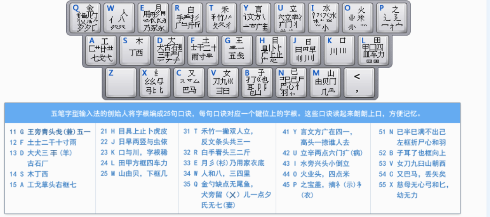

**A区(横)**

11(G) 王旁青头戋（兼）五一，
12(F) 土士二干十寸雨。二一还有革字底
13(D) 大犬三羊古石厂，羊有直斜套去大，（“羊”指羊字底）
14(S) 木丁西，
15(A) 工戈草头右框七。（“草头”指“*”，“右框”即“匚”）
**B区（竖）**

21(H) 目具上止卜虎皮，（“具上”指具字的上部）
22(J) 日早两竖与虫依。
23(K) 口与川，字根稀，
24(L) 田甲方框四车力。（“方框”即“囗”）
25(M) 山由贝，下框几。（“下框”即“冂”）
**C区（撇）**

31(T) 禾竹一撇双人立，反文条头共三一。（“双人立”即“彳”，“条头”即“夂”）
32(R) 白手看头三二斤，（“看头”即看的上边，也是“手”）
33(E) 月彡(衫)乃用家衣底。（“家衣底”即“豕”）
34(W) 人和八，三四(34)里，（“人”和“八”在34里边）
35(Q) 金勺缺点无尾鱼， 犬旁留叉儿一点夕， 氏无七（妻）。（“勺缺点”指“勹”，犬旁句指“犭”、“儿”、“夕”，氏无妻指“氏”去掉“七”）
**D区（捺）**

41(Y) 言文方广在四一，高头一捺谁人去。（“谁”去“亻”为“”）
42(U) 立辛两点六门疒，（“病”即“疒”）
43(I) 水旁兴头小倒立。（“水旁”指“氵”）
44(O) 火业头，四点米，
45(P) 之字军盖建道底， 摘礻(示)衤(衣)。（即“之、宀、冖、廴、辶”，“礻、衤”摘除右边的点））
**E区（折）**

51(N) 已半巳满不出己， 左框折尸心和羽。
52(B) 子耳了也框向上。（“框向上”即“凵”）
53(V) 女刀九臼山朝西。（“山朝西”即“彐”）
54(C) 又巴马，丢矢矣，（“矣”去“矢”为“厶”）
55(X) 慈母无心弓和匕， 幼无力。（“幼”无“力”为“幺”）

1. 一级简码：键按一下

   一地在要工
   上是中国同
   和的有人我
   主产不为这
   民了发以经

2. 键名字：字根表每句第一个字。键按四下

3. 成字字根：
   (1）报户口
   (2）第一笔所属区
   (3）第二笔所属区
   (4）最后一笔所属区
   (这样的字不多。举例：五、止、士）

4. 多字根组成的字（情况一）

   (1）第一个字根
   (2）第二个字根
   (3）第三个字根
   (4）最后一个字根
   (常用。举例：繁、例、葡）

5. 多字根组成的字（情况二）:
   有些字不足4个字根，字根已经打完却没有出来，就需要结构识别码
   (1）第一个字根
   (2）第二个字根
   (3）如果有的话：第三个字根
   (4）识别码：字的最后一笔属于哪个区，就在哪个区里找
   左右结构打1号键，上下结构打2号键，其余结构打3号键
   (常用。举例：孕、豪、鱼）

6. 笔划本身：一、丨、丿、丶、乙
   先按区首键两下，再按两下L键。一、丨、丿、丶、乙